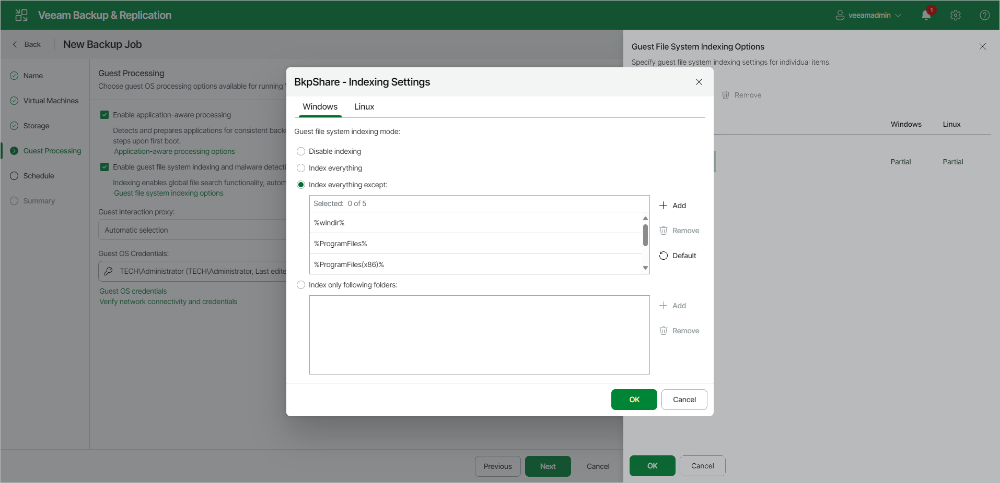

# Enable Guest File System Indexing and Malware Detection

In this article

To specify VM guest OS indexing options for a VM:

1. At the Guest Processing step of the wizard, select the Enable guest file system indexing and malware detection check box.
2. Click Guest file system indexing options.
3. Select a VM in the list and click Edit.
4. In the Indexing Settings window, click Windows or Linux tab.
5. Specify the indexing scope:

+ Select Disable indexing if you do not want to index guest OS files of the VM.
+ Select Index everything if you want to index all VM guest OS files.
+ Select Index everything except if you want to index all VM guest OS files except those defined in the list. By default, system folders are excluded from indexing. You can add or delete folders using the Add and Remove buttons on the right. You can also use system environment variables to form the list, for example, %windir%, %ProgramFiles% and %Temp%.

To reset the list of folders to its initial state, click Default.

+ Select Index only following folders to define the folders you want to index. You can add or delete folders to index using the Add and Remove buttons on the right. You can also use system environment variables to form the list, for example, %windir%, %ProgramFiles% and %Temp%.

|  |
| --- |
| Note |
| [For Linux VMs] To perform guest OS file indexing, Veeam Backup & Replication requires several utilities to be installed on the Linux VM: openssh, gzip and tar. If these utilities are not found, Veeam Backup & Replication will prompt you to deploy them on the VM guest OS. |

Page updated 12/9/2025

Page content applies to build 13.0.1.1071
