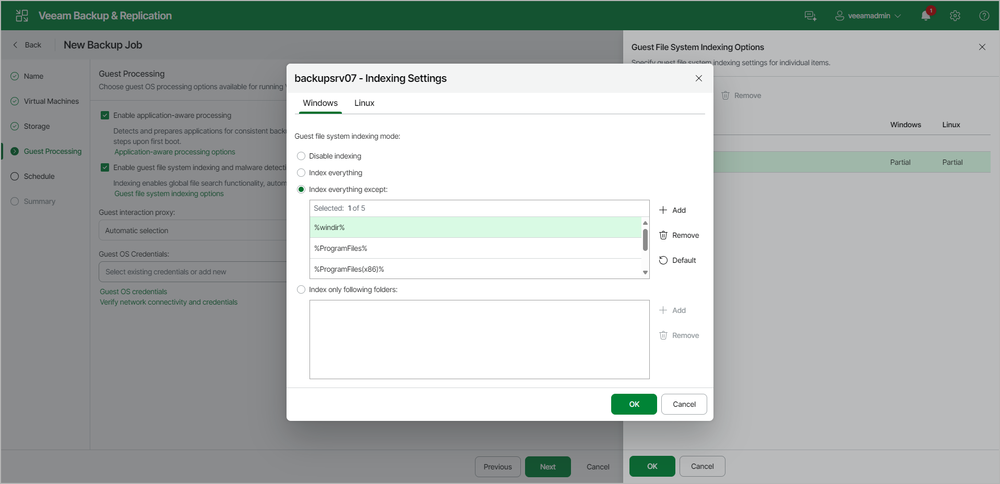

# Enable Guest File System Indexing and Malware Detection

To configure VM guest OS indexing options for a specific VM, do the following:

1. At the Guest Processing step of the wizard, set the Enable guest file system indexing and malware detection toggle to On.
2. Click the Customize guest processing link.
3. Select a VM in the list and click Other Actions > Guest Indexing, or right-click the VM and select Guest Indexing. To quickly find a specific VM in the list, enter its name in the Search field.
4. In the Indexing Settings window, click the Windows or Linux tab.
5. Specify the indexing scope:

* Select the Disable indexing option if you do not want to index the guest OS files of the VM.
* Select the Index everything option if you want to index all VM guest OS files.
* Select the Index everything except option if you want to index all VM guest OS files except those defined in the list. By default, system folders are excluded from indexing. To add or delete folders, use the Add and Remove buttons on the right. You can also use system environment variables to form the list, for example, %windir%, %ProgramFiles% and %Temp%.

To reset the list of folders to its initial state, click Default.

* Select the Index only following folders option to define the folders you want to index. You can add or delete folders to index using the Add and Remove buttons on the right. You can also use system environment variables to form the list, for example, %windir%, %ProgramFiles% and %Temp%.

|  |
| --- |
| Important |
| To perform guest OS file indexing on Linux VMs, Veeam Backup & Replication requires several utilities to be installed on the Linux VM: openssh, gzip and tar. If these utilities are not found, Veeam Backup & Replication will prompt you to deploy them on the VM guest OS. |

Page updated 2026-07-15

