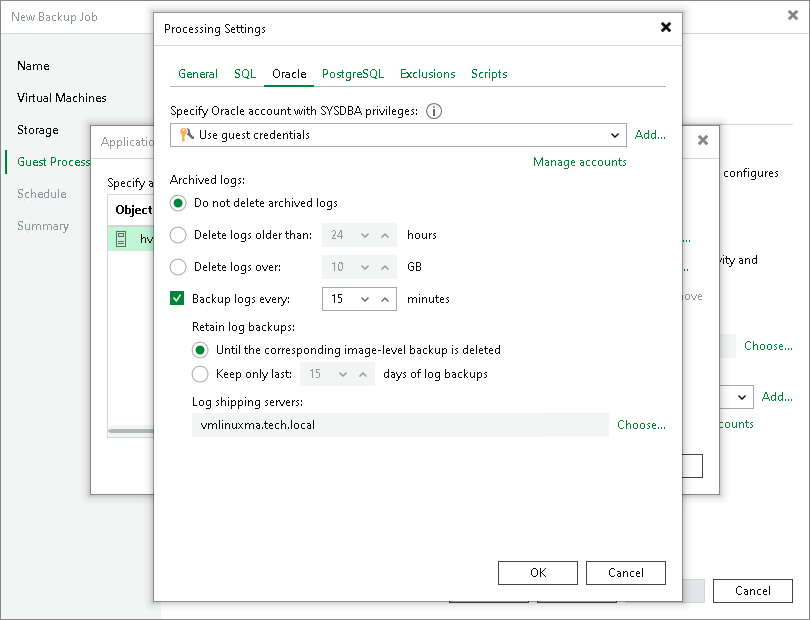

# Oracle Archived Redo Log Settings

To create a transactionally consistent backup of a VM where Oracle Database is deployed, you must enable application-aware processing and define how Veeam Backup & Replication> will process archived redo logs on this VM.

To specify Oracle archived redo logs, do the following:

1. In the Processing Settings window, click the Oracle tab.
2. In the Specify Oracle account with SYSDBA privileges section, specify a user account that Veeam Backup & Replication will use to connect to the Oracle database. The account must have privileges for the Oracle database listed in section [Performing Guest Processing](required_permissions.md#rptcb).

You can select Use guest credentials in the list of user accounts. In this case, Veeam Backup & Replication will use the account specified at the Guest Processing step of the wizard to access the VM guest OS and connect to the Oracle database.

1. In the Archived logs section, specify how Veeam Backup & Replication must process archived redo logs on the Oracle VM:

* Select Do not delete archived logs if you want Veeam Backup & Replication to preserve archived logs on the VM guest OS. When the backup job completes, the non-persistent runtime components or persistent components will not delete archived logs.

It is recommended that you select this option for databases in the NOARCHIVELOG mode. If the database is in the ARCHIVELOG mode, archived logs on the VM guest OS may grow large and consume all disk space. In this case, database administrators must take care of archived logs themselves.

* Select Delete logs older than <N> hours or Delete logs over <N> GB if you want Veeam Backup & Replication to delete archived logs that are older than <N> hours or larger than <N> GB. The log size threshold refers not to the total size of all logs for all databases but to the log size of each database on the selected Oracle VM.

When the parent backup job (job creating an image-level backup) runs, Veeam Backup & Replication will wait for the backup to complete successfully and then trigger archived log deletion on the Oracle VM over Oracle Call Interface (OCI). If the primary job does not manage to back up the Oracle VM, the logs will remain untouched on the VM guest OS until the next start of the non-persistent runtime components or persistent components.

1. To back up Oracle archived logs with Veeam Backup & Replication, select the Backup logs every <N> minutes check box and specify the frequency for archived log backup. By default, archived logs are backed up every 15 minutes. The maximum log backup interval is 480 minutes.
2. In the Retain log backups section, specify the retention policy for archived logs stored in the backup repository:

+ Select Until the corresponding image-level backup is deleted to apply the same retention policy for image-level backups and archived log backups.
+ Select Keep only last <N> days of log backups to keep archived logs for a specific number of days. By default, archived logs are kept for 15 days. If you select this option, you must make sure that retention for archived logs is not greater than retention for the image-level backups. For more information, see [Retention for Archived Log Backups](oracle_backup_retention_hv.md).

1. In the Log shipping servers section, click Choose to select what log shipping server you want to use to transport archived logs:

+ Select Automatic selection if you want Veeam Backup & Replication to select an optimal log shipping server automatically. The process of archived logs shipment does not require a dedicated server — Veeam Backup & Replication can use any Microsoft Windows server added to the backup infrastructure.
+ Select Use the specified servers only to define a log shipping server explicitly. In the Log Shipping Servers window, select check boxes next to the servers you want to use as log shipping servers. The server list includes all Microsoft Windows servers added to the backup infrastructure.

Make sure that you select a server that is not engaged in other resource-consuming tasks. For example, you may want not to use a server that performs the WAN accelerator role as a log shipping server. For load balance and high availability purposes, it is recommended that you select at least 2 log shipping servers.

