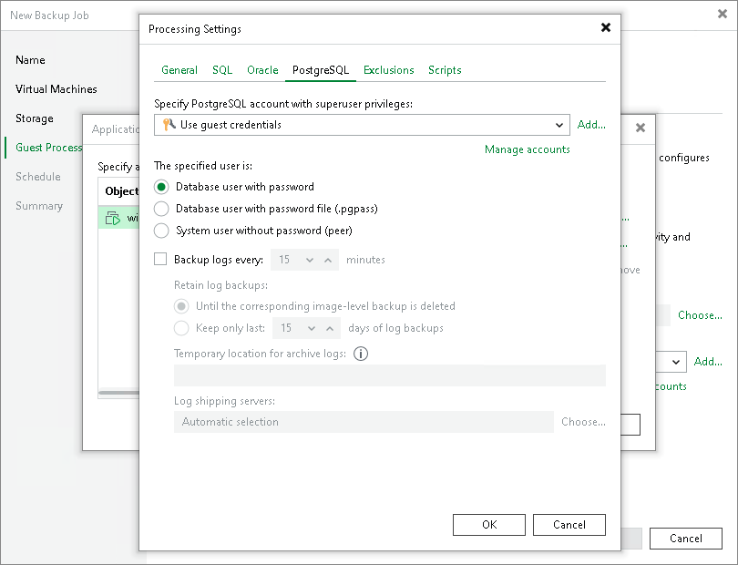

# PostgreSQL WAL Files Settings

To create a transactionally consistent backup of PostgreSQL VM, you must enable application-aware processing and define the settings of WAL files processing.

|  |
| --- |
| Note |
| By default, Veeam Backup & Replication recursively scans the /etc/postgresql, /var/lib/postgresql and /var/lib/pgsql directories for the configuration files of PostgreSQL instances. If you keep configuration files in custom directories, the pgsqlagent agent will use its own VeeamPostgreSQLAgent.xml configuration file that is located in the /etc/veeam/ directory. The pgsqlagent agent configuration file must be a single line XML.  To explicitly include or exclude specific configuration files from rescan, you can add the following commands to the VeeamPostgreSQLAgent.xml file:   * ExcludeConfigDirs — use this element to exclude configuration files. * AddConfigDirs — use this element to include configuration files.   For example: <config AddConfigDirs="/opt/psql/" ExcludeConfigDirs="/var/lib/postgresql/13/main45/,/var/lib/postgresql/13/maindd/" /> |

To specify WAL files settings and back up PostgreSQL logs, do the following:

1. In the Processing Settings window, click the PostgreSQL tab.
2. From the Specify PostgreSQL account with superuser privileges drop-down list, select a user account that Veeam Backup & Replication will use to connect to the PostgreSQL instance. The account must have privileges described in section [Permissions](required_permissions.md#postgresql). If you have not set up credentials beforehand, click the Manage accounts link or click Add on the right to add credentials.

By default, the Use guest credentials option is selected in the list. With this option selected, Veeam Backup & Replication will connect to the PostgreSQL instance under the account. In this case, Veeam Backup & Replication will use the account specified at the Guest Processing step of the wizard to access the VM guest OS and connect to the PostgreSQL instance.

Note that if you plan to select the System user without password file (peer) authentication method at the step 3 of this procedure, you can add a user account in the [Credentials Manager](credentials_manager.md) without specifying the password for the account.

1. In The specified user is section, specify how the user will authenticate against the PostgreSQL instance:

* Select Database user with password if the account you specified at the step 2 is a PostgreSQL account, and you entered the password for this account in the Credentials Manager.

|  |
| --- |
| Note |
| If you want Veeam Backup & Replication to use the user name map authentication, select Database user with password and leave the password field empty. Consider the following:   * Guest OS credentials specified at the Guest Processing step of the wizard will be used as the System-Username.  * PostgreSQL account specified at the step 2 will be used as the PG-Username.   For more information about the user name maps, see [PostgreSQL documentation](https://www.postgresql.org/docs/current/auth-username-maps.html). |

* Select Database user with password file (.pgpass) if the password for the account you specified at the step 2 is defined in the .pgpass configuration file on the PostgreSQL VM. The password file must be located in the user's home directory. For more information about the password file, see [PostgreSQL documentation](https://www.postgresql.org/docs/current/libpq-pgpass.html).
* Select System user without password file (peer) if you want Veeam Backup & Replication to use the peer authentication method. In this case, Veeam Backup & Replication will use the account you specified at the step 2 as the OS account and as the PostgreSQL account to connect to PostgreSQL. For more information about the peer authentication method, see [PostgreSQL documentation](https://www.postgresql.org/docs/current/auth-peer.html).

|  |
| --- |
| Important |
| If you have added a new PostgreSQL account and want to use it with the peer authentication method, make sure that you have added this account as a Linux user with [sufficient permissions](required_permissions.md#postgresql). |

1. To back up PostgreSQL WAL files with Veeam Backup & Replication, select the Backup logs every <N> minutes check box and specify the frequency for WAL files backup. By default, WAL files are backed up every 15 minutes. The maximum log backup interval is 480 minutes.

1. In the Retain log backups section, specify the retention policy for WAL files stored in the backup repository:

+ Select Until the corresponding image-level backup is deleted to apply the same retention policy for both image-level backups and WAL file backups.
+ Select Keep only last <N> days of log backups to keep WAL files for a specific number of days. By default, WAL files are kept for 15 days. If you select this option, you must make sure that retention for WAL files is not greater than retention for the image-level backups. For more information, see [Retention for PostgreSQL WAL Files](postrgresql_backup_retention.md).

1. In the Temporary location for archive logs section, specify a path to the storage location where you want to keep WAL files.

1. In the Log shipping servers section, click Choose to select what log shipping server you want to use to transport WAL files:

+ Select Automatic selection if you want Veeam Backup & Replication to select an optimal log shipping server automatically. The process of WAL files shipment does not require a dedicated server — Veeam Backup & Replication can use any Microsoft Windows server added to the backup infrastructure.
+ Select Use the specified servers only to define a log shipping server explicitly. In the Log Shipping Servers window, select check boxes next to the servers you want to use as log shipping servers. The server list includes all Microsoft Windows servers added to the backup infrastructure.

Make sure that you select a server that is not used by other resource-consuming tasks. For example, you may want not to use a server that performs the WAN accelerator role as a log shipping server. For load balance and high availability purposes, it is recommended that you select at least 2 log shipping servers.

