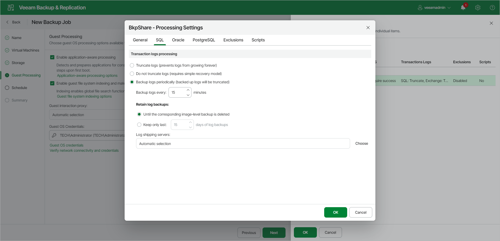

# Microsoft SQL Server Transaction Log Settings

In this article

To create a transactionally consistent backup of SQL VM, you must enable application-aware processing and define settings of transaction logs processing.

To define how Veeam Backup & Replication will process transaction logs on this VM, do the following:

1. In the Processing Settings window, click the General tab.
2. In the VSS Settings section, select Process transaction logs with this job. For more information, see [VSS settings](backup_job_vss_application_vm_web.md#vss).
3. Switch to the SQL tab.
4. Specify how transaction logs must be processed. You can select one of the following options:

* Select Truncate logs to truncate transaction logs after successful backup. The non-persistent runtime components or persistent components running on the VM guest OS will wait for the backup to complete successfully and then truncate transaction logs. If the job does not manage to back up the Microsoft SQL Server VM, the logs will remain untouched on the VM guest OS until the next start of the non-persistent runtime components or persistent components.

|  |
| --- |
| Note |
| If the account specified at the [Guest Processing](backup_job_vss_hv.md) step does not have enough rights, Veeam Backup & Replication tries to truncate logs using the local SYSTEM account for Microsoft SQL Server 2008 and 2008 R2. For other Microsoft SQL Server versions, Veeam Backup & Replication uses NT AUTHORITY\SYSTEM account.  Make sure that these accounts have permissions listed in section [Performing Guest Processing](required_permissions.md#rptcb). |

* Select Do not truncate logs to preserve transaction logs. When the backup job completes, Veeam Backup & Replication will not truncate transaction logs on the Microsoft SQL Server VM.

It is recommended that you enable this option for databases that use the Simple recovery model. If you enable this option for databases that use the Full or Bulk-logged recovery model, transaction logs on the VM guest OS may grow large and consume all disk space. In this case, the database administrators must take care of transaction logs themselves.

* Select Backup logs periodically to back up transaction logs with Veeam Backup & Replication. Veeam Backup & Replication will periodically copy transaction logs to the backup repository and store them together with the image-level backup of the Microsoft SQL Server VM. During the backup job session, transaction logs on the VM guest OS will be truncated. For more information, see [Microsoft SQL Server Log Backup](sql_backup_hv.md).

To learn more about logging models and applicable options in Veeam Backup & Replication, see the [Recovery Model](https://helpcenter.veeam.com/docs/vbr/explorers/vesql_bu_job_settings.html?ver=13#recovery-model) section of the Veeam Explorers User Guide.

1. In the Backup logs every <N> minutes field, specify the frequency for transaction log backup. By default, transaction logs are backed up every 15 minutes. The maximum log backup interval is 480 minutes.
2. In the Retain log backups section, specify the retention policy for transaction logs stored in the backup repository.

* Select Until the corresponding image-level backup is deleted to apply the same retention policy for image-level backups and transaction log backups.

* Select Keep only last <N> days of log backups to keep transaction logs for a specific number of days. By default, transaction logs are kept for 15 days. If you select this option, you must make sure retention for transaction logs is not greater than retention for the image-level backups. For more information, see [Retention for Transaction Log Backups](sql_backup_retention_hv.md).

1. In the Log shipping servers section, click Choose to select what log shipping server you want to use to transfer transaction logs over the network:

* Select Automatic selection if you want Veeam Backup & Replication to choose an optimal log shipping server automatically. If the optimal shipping server is busy, Veeam Backup & Replication will direct the data flow to another shipping server so as not to lose data and comply with RPO. The process of transaction logs shipment does not require a dedicated server — Veeam Backup & Replication can use any Microsoft Windows server added to the backup infrastructure.

* To define a log shipping server explicitly, select Use the specified servers only and select check boxes next to servers that you want to use as log shipping servers. The server list includes all Microsoft Windows servers added to the backup infrastructure.

Make sure that you select a server that is not engaged in other resource-consuming tasks. For example, you may want not to use a server that performs the WAN accelerator role as a log shipping server. For load balance and high availability purposes, it is recommended that you select at least 2 log shipping servers.

For more information on log shipping servers and how they are selected, see [Log Shipping Servers](sql_backup_log_shipping_hv.md).

|  |
| --- |
| Important |
| Veeam Backup & Replication automatically excludes its configuration database from application-aware processing during backup if the database is hosted without using SQL Server Always On Availability Group. Transaction logs for the configuration database are not backed up. If the Veeam Backup & Replication configuration database is hosted using SQL Server Always On Availability Group, you should manually exclude this database from application-aware processing during backup, as described in [this Veeam KB article](https://www.veeam.com/kb2110). Otherwise, job processing will fail with the following error: Failed to freeze guest over network, wait timeout. |

Page updated 12/9/2025

Page content applies to build 13.0.1.1071
