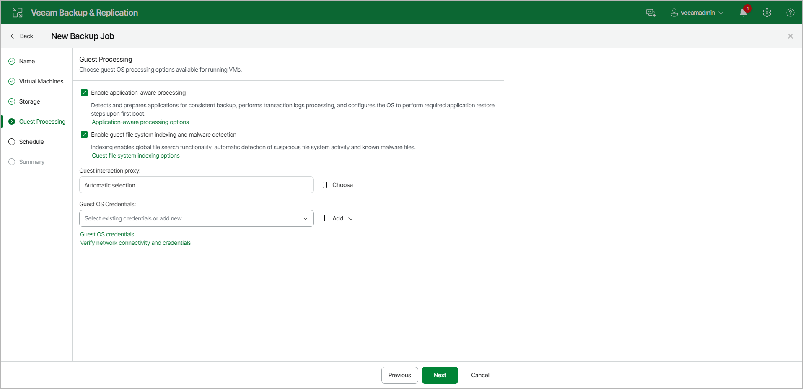

# Step 8. Specify Guest Processing Settings

At the Guest Processing step of the wizard, you can configure the following settings:

* [Enable application-aware processing](backup_job_vss_application_vm_web.md) — to create a transactionally consistent backup of VMs running VSS-aware applications. The transactionally consistent backup guarantees the proper recovery of applications on VMs without data loss. For details on application-aware processing settings, see [Application-Aware Processing](backup_job_vss_application_vm_web.md).
* [Enable guest file system indexing and malware detection](backup_job_vss_indexing_vm_web.md) — to create a catalog of files located on the guest OS. The catalog allows you to browse, search and perform 1-click restores of individual files. Guest indexing data in the catalog is scanned for suspicious file system activity and malware files. For more information, see [Preparing for File Browsing and Searching](https://helpcenter.veeam.com/docs/vbr/em/preparing_for_file_browsing.html?ver=13) section in the Enterprise Manager User Guide. For details on guest OS file indexing settings, see [VM Guest OS File Indexing](backup_job_vss_indexing_vm.md). For details on malware detection, see [How Guest Indexing Data Scan Works](malware_detection_guest_index_hiw.md).
* [Choose guest interaction proxy](backup_job_vbr_vss_proxy_choose_web.md) — to specify interaction proxy settings that Veeam Backup & Replication will use to install non-persistent runtime components or use (if necessary, install) persistent agent components in each VM.
* [Manage guest OS credentials](backup_job_vbr_credentials_manage_web.md) — to specify credentials that allow Veeam Backup & Replication to connect to the VM guest OS.

