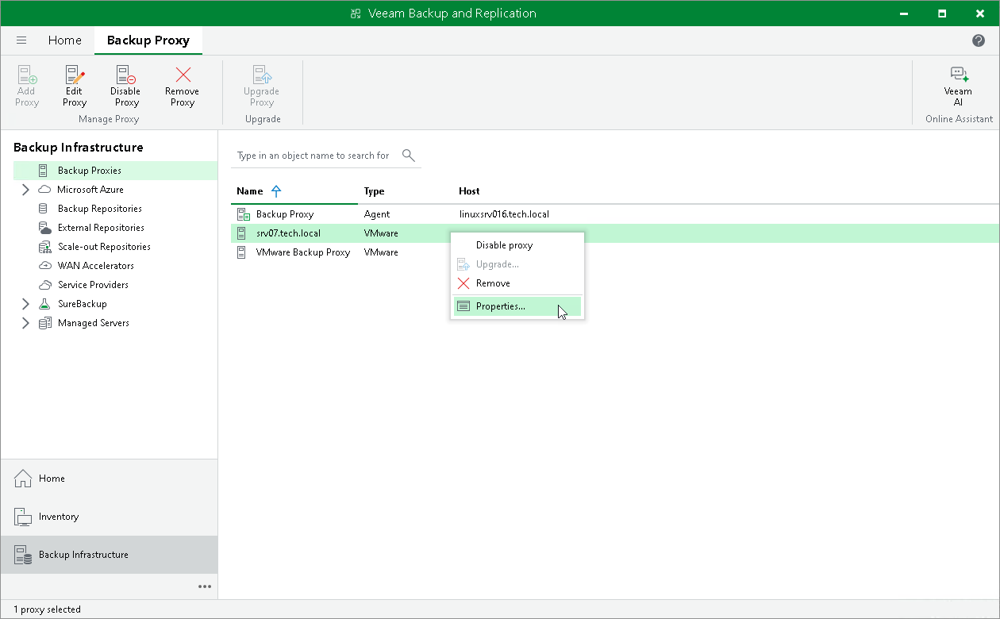

# Editing VMware Backup Proxy Settings

In this article

You can edit settings of backup proxies you have configured.

To edit VMware backup proxy settings:

1. Open the Backup Infrastructure view.
2. In the [inventory pane](vbr_ui.md), select the Backup Proxies node.
3. In the working area, select the VMware backup proxy and click Edit Proxy on the ribbon or right-click the VMware backup proxy and select Properties.
4. Edit VMware backup proxy settings as required.

Page updated 12/21/2023

Page content applies to build 13.0.1.1071
