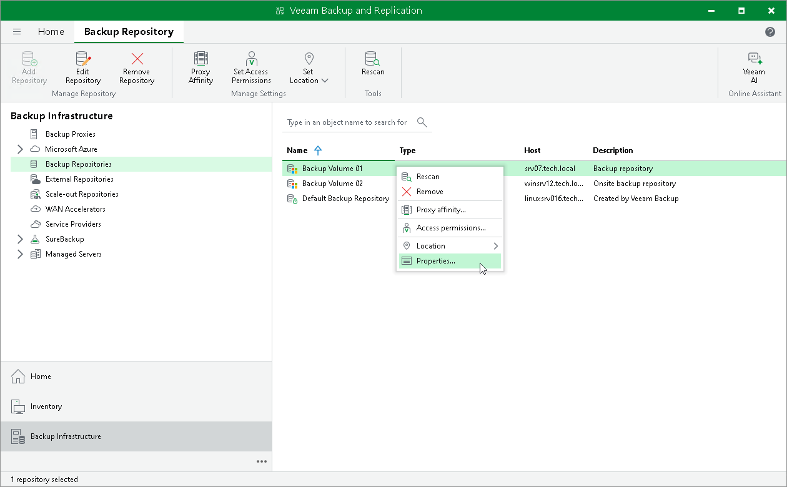

# Editing Settings of Backup Repositories

In this article

You can edit settings of backup repositories that you have added to the backup infrastructure.

|  |
| --- |
| Note |
| When editing backup repository settings, you cannot change the selected repository server. Therefore, the Repository server field at the Server step is grayed out. |

|  |
| --- |
| Tip |
| The following column headers show information on the repository storage settings:   * The Capacity column header — specifies a full size of a storage location where you keep your backups. * The Free column header — specifies the amount of free space on a storage location. It considers a size of all data that is already added to this storage location without using Veeam Backup & Replication. For example, if the storage location capacity is 100 GB, and you added to this location data that occupies 50 GB, the Free column header will display 50 GB. * The Used Space column header — specifies the amount of space occupied by backups created by Veeam Backup & Replication. Note that it does not consider data compression and deduplication that is not performed by means of Veeam Backup & Replication. For example, if Veeam Backup & Replication creates a backup that occupies 10 GB, and a size of this backup decreases to 9 GB after compression or deduplication performed by a storage appliance, the Used Space column header will display 10 GB. * The Membership column header — specifies a scale-out backup repository to which repositories are added as performance extents. This column is hidden by default. To display it, right-click any column header and select Membership from the drop-down menu. |

To edit settings of a backup repository:

1. Open the Backup Infrastructure view.
2. In the inventory pane, select the Backup Repositories node.
3. In the working area, select the backup repository and click Edit Repository on the ribbon or right-click the backup repository and select Properties.
4. Edit the backup repository settings as required. Note that you cannot change the selected repository server and path to the folder used for storing backups.

Page updated 6/22/2023

Page content applies to build 13.0.1.1071
