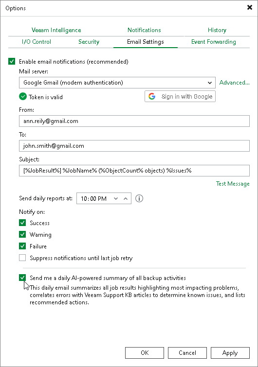

# Enabling Email Reporting

In this article

You can set up Veeam Backup & Replication to send reports automatically by email. The reports include information about software updates and a detailed overview of all job sessions and their statuses.

Consider the following:

* Reports are sent only after you enable and configure the global email notification settings, as described in section [Configuring Global Email Notification Settings](general_email_notifications.md).
* Reports are sent daily at the time specified in the global notification settings.
* Reports are sent for all notification types selected in the global notification settings, such as Success, Warning and Failure.

Backup Job Session Report

By default, Veeam Backup & Replication sends an email notification after each backup job session completes. You can enable and specify custom notification settings for a specific backup job. This may be useful if you want to change the subject, the notification rules, or the list of recipients for certain reports. For detailed instructions, see [Notification Settings](backup_job_advanced_notify_hv.md).

Software Updates Summary

By default, Veeam Backup & Replication sends a daily report at 10:00 PM that includes a list of software updates that ended with Success, Warning or Failure.

Data Resilience Daily Summary Report (Morning Coffee Report)

The AI-generated daily summary report gives a detailed overview of all job sessions and their statuses. The report lists errors and warnings, explains their causes, and recommends actions to resolve them. It also includes links to relevant resources and groups error codes by workload, which helps simplify the troubleshooting process.

To configure Veeam Backup & Replication to send the data resilience daily summary report by email, you must enable Veeam Intelligence Advanced mode and have a valid Veeam Backup & Replication license.

To turn on the report, do the following:

1. From the main menu, select Options.
2. On the Veeam Intelligence tab, select Advanced mode. For more information about the Advanced mode, see [Veeam Intelligence](veeam_ai_online_assistant.md#advanced_mode).
3. On the Email Settings tab, select the Send me a daily AI-powered summary of all backup activities option.

Page updated 12/29/2025

Page content applies to build 13.0.1.1071
