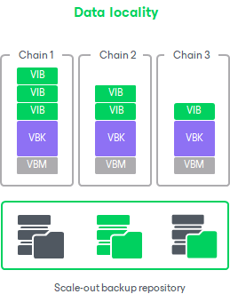
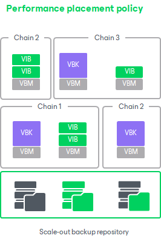

# Backup File Placement for Performance Tier

In this article

Veeam Backup & Replication stores backup files on all performance extents of the scale-out backup repository.

When you configure a scale-out backup repository, you must set the backup file placement policy for backup repositories. The backup file placement policy describes how backup files are distributed between extents. You can choose one of the following policies:

* [Data locality](backup_repository_sobr_placement.md#locality)
* [Performance](#performance)

You can also select an extent for backup file placement, which has its nuances if you set the Performance policy for the scale-out backup repository:

* [Extent Selection](#extent_selection)
* [Extent Selection for Backup Repositories with Performance Policy](#extent_selection_performance)
* [Extent Selection for Object Storage Repositories Added as Performance Extents](#extent_selection_objectstorage)

Keep in mind that at the beginning of a job, Veeam Backup & Replication retrieves the actual free space on a scale-out backup repository and estimates the size of a restore point to be created. Then the estimated restore point size is subtracted from the actual free space to determine the estimated free space. This estimated free space is then used by all further concurrently running jobs targeted at the same scale-out backup repository. For details, see [Backup Size Estimation](#size_estimation).

If you do not select the Strict placement policy enforcement check box when you [specify backup placement policy](sobr_add_policy.md), and if the necessary extent is not accessible, Veeam Backup & Replication will disregard the policy limitations and attempt to place the backup file to the extent that has enough free space for the backup file.

For example, you have set the Performance policy for the scale-out backup repository and specified that full backup files must be stored on Extent 1 and incremental backup files must be stored on Extent 2. If before an incremental backup job session Extent 2 goes offline, the new incremental backup file will be placed to Extent 1.

|  |
| --- |
| Note |
| Veeam Backup & Replication places backups of Microsoft SQL transaction logs, Oracle archived logs and PostgreSQL WAL files to the extent configured for storing incremental backup files. If such extent is not accessible, Veeam Backup & Replication will attempt to place log backups to any other extent that has enough free space. |

Data Locality

If you set the Data locality policy for a scale-out backup repository, all backup files that belong to the same backup chain are stored on the same extent of the scale-out backup repository.

The Data locality policy does not put any limitations to backup chains. A new backup chain can be stored on the same extent or another extent. For example, if you create an active full backup, Veeam Backup & Replication may store the full backup file to another extent, and all dependent incremental backup files will be stored together with this full backup file.

|  |
| --- |
| Note |
| If you use a deduplicating storage appliance as an extent to the scale-out backup repository, Veeam Backup & Replication will attempt to place a new full backup (active or synthetic) to the extent where the full backup from the previous backup chain resides. Such behavior will help increase the data deduplication ratio. However, if you use ExaGrid appliances as extents of scale-out backup repository, Veeam Backup & Replication will place a new backup to the extent with the highest storage capacity. |

|  |
| --- |
| Tip |
| If you plan to use [Fast Clone](backup_repository_block_cloning.md) on performance extents with volumes formatted with ReFS or XFS, select Data locality. |

Performance

If you set the Performance policy for a scale-out backup repository, full backup files and incremental backup files that belong to the same backup chain are stored on different extents of the scale-out backup repository. If necessary, you can explicitly specify on which extents full backup files and incremental backup files must be stored.

The Performance policy can improve performance of transformation processes if you use raw data devices as extents. When Veeam Backup & Replication performs transformation, it needs to access a number of backup files in the backup repository. If these files are located on different storage devices, the I/O load on the devices hosting backup files will be lower.

If you set the Performance policy, you must make sure that the network connection between extents is fast and reliable. You must also make sure all extents are online when the backup job, backup copy job or a restore task starts. If any extent hosting backup files in the current backup chain is not available, the backup chain will be broken, and Veeam Backup & Replication will not be able to complete the task. To avoid data loss in this situation, you can enable the Perform full backup when required extent is offline option for the scale-out backup repository. With this option enabled, Veeam Backup & Replication will create a full backup instead of incremental backup if some files are missing from the backup chain.

Extent Selection

To select an extent for backup file placement, Veeam Backup & Replication checks the following conditions:

1. Availability of extents on which backup files reside. If some extent with backup files from the current backup chain is not accessible, Veeam Backup & Replication will trigger a full backup instead of incremental (if this option is enabled). For more information, see [Adding Backup Repository Extents](sobr_add_extents.md).
2. Backup placement policy set for the scale-out backup repository.
3. Load control settings — maximum number of tasks that the extent can process simultaneously.

|  |
| --- |
| Important |
| If a Service Provider uses an extent as a cloud repository, Veeam Backup & Replication compares the percentage of active tasks over the extent task limit and selects the extent with the least load over the extent. For example, if the A extent tasks limit is 5 tasks, and currently 3 tasks are active, and the B extent tasks limit is 30 tasks, and 10 tasks are currently running, Veeam Backup & Replication selects the B extent. If there are several extents with equal percentage values, Veeam Backup & Replication checks a disc space and selects the best suitable extent based on this check. For example, if there are extents with the same percentage of running tasks, Veeam Backup & Replication compares their disk space and selects the extent with the least disk space occupied. |

1. Amount of free space available on the extent — the backup file is placed to the extent with the most amount of free space.
2. Availability of files from the current backup chain — extents that host incremental backup files from the current backup chain (or current VM) have a higher priority than extents that do not host such files.

Extent Selection for Backup Repositories with Performance Policy

If you set the Performance policy for the scale-out backup repository, Veeam Backup & Replication always stores full backup files and incremental backup files that belong to the same backup chain on different extents. To choose the extent to which a backup file can be stored, Veeam Backup & Replication applies this policy and policies mentioned above.

For example, a scale-out backup repository has 2 extents that have 100 GB and 200 GB of free space. You set the Performance policy for the scale-out backup repository and define that all types of backup files (full and incremental) can be placed on both extents.

When a backup job runs, Veeam Backup & Replication picks the target extent in the following manner:

1. During the first job session, Veeam Backup & Replication checks to which extent a full backup file can be stored. As both extents can host the full backup file, Veeam Backup & Replication checks which extent has more free space, and picks the extent that has 200 GB of free space.
2. During incremental job session, Veeam Backup & Replication checks to which extent an incremental backup file can be stored. As both extents can host the incremental backup file, Veeam Backup & Replication picks the extent that does not store the full backup file — the extent that has 100 GB of free space.

Extent Selection for Object Storage Repositories Added as Performance Extents

If you add an object storage repository as a performance extent, neither data locality nor performance policies are applied to these extents. Instead, Veeam Backup & Replication checks the following conditions to distribute data between extents.

1. During the first job session, Veeam Backup & Replication checks availability of extents. In case, an extent is set to [Sealed](sobr_seal.md) or [Maintenance](sobr_maintenance.md) mode, these extents will be skipped from backup file placement.
2. After that, Veeam Backup & Replication checks the amount of backup chains in available extents and selects the extent with a minimal amount of backup chains.
3. If some extents have storage space limitations, Veeam Backup & Replication calculates the average storage of the backup chains located in all extents and select the extent that contains a minimum amount of backup chains. If all extents have the same number of backup chains, Veeam Backup & Replication selects the extent that has more free space.
4. During subsequent job sessions, Veeam Backup & Replication moves backup chains to the extent that was specified before.

|  |
| --- |
| Note |
| If an extent is set to Sealed mode or Maintenance mode, Veeam Backup & Replication will not target a backup chain to this extent. In this case, Veeam Backup & Replication starts a new backup chain on a new extent and follows the same algorithm as during the first job session. Veeam Backup & Replication will remove backup chains from the Sealed extents according to [retention policy](capacity_tier_retention.md). |

Backup Size Estimation

At the beginning of a job, Veeam Backup & Replication retrieves the actual free space on a scale-out backup repository and estimates the size of a restore point to be created. Then the estimated restore point size is subtracted from the actual free space to determine the estimated free space. This estimated free space is then used by all further concurrently running jobs targeted at the same scale-out backup repository.

Veeam Backup & Replication assumes that the following amount of space is required for backup files:

* The size of the first full backup file is equal to 50% of source VM data.
* The size of further full backup files is equal to 100% of the previous full backup file size.
* The size of the first incremental backup file is equal to 10% of the previous full backup file size.
* The size of further incremental backup files in the backup chain is equal to 100% of the previous incremental backup file size.

In case of reverse incremental backup chains, during incremental job sessions Veeam Backup & Replication allocates 10% of the previous full backup file size on the extent where a rollback file is placed and additional 10% on the extent where the full backup file resides.

This mechanism is also applied to backup files created by backup copy jobs.

|  |
| --- |
| Note |
| Consider the following:   * On every extent of a scale-out backup repository, Veeam Backup & Replication reserves 1% of storage space to guarantee correct update of backup metadata files (VBM) and success of merge operations. * Make sure that you have enough free space on the extent where the full backup file resides. Veeam Backup & Replication requires 10% of the size of the full backup file to perform merge operations in the backup chain. If the disk space is low, merge operations may fail. * The actual free space value is only captured at the start of a job targeted at the scale-out backup repository while no other jobs actively use the same scale-out backup repository. For more information, see [this Veeam KB article](https://www.veeam.com/kb2282). |

Page updated 2/13/2025

Page content applies to build 13.0.1.1071
