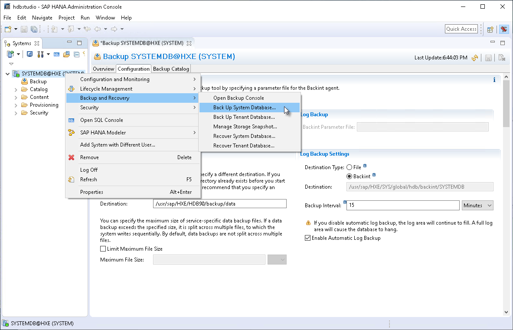
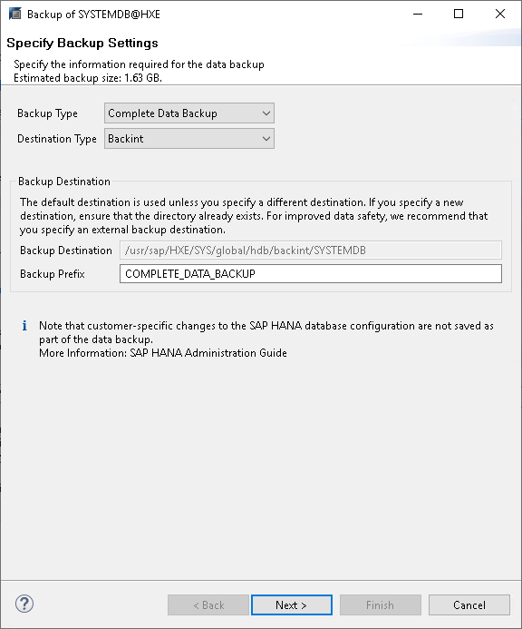
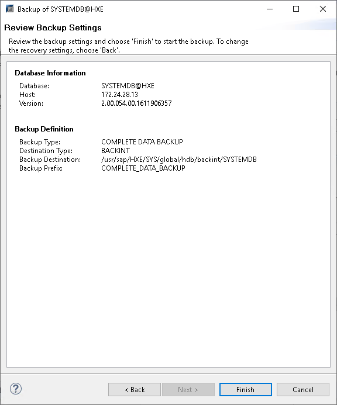

# Database Backup (SAP HANA Studio)

After you [configure Veeam Plug-In settings](configure_sap_hana_plugin.md), you can back up your databases using SAP HANA Studio. Veeam Plug-In will automatically transform backup files to a Veeam backup repository.

The example provided below is for demonstration purposes only. For details on the full backup functionality of SAP HANA Studio, see [this SAP article](https://help.sap.com/docs/SAP_HANA_PLATFORM/f157e7b47b2a417a99eadd4b6c433b77/c51a3983bb571014afa0c67026e44ca0.html?locale=en-US&version=2.0.06).

To perform Backint backup with SAP HANA Studio, do the following:

1. In SAP HANA Studio, connect to the database as a user with DATABASE ADMIN privileges.
2. In the Systems view, right-click the database.
3. Select Backup and Recovery and then select Back Up System Database or Back Up Tenant Database.

1. In the backup wizard, specify backup settings:

1. Select the required backup type:

* Complete Data Backup: backup of all data structures required to recover the database.
* Incremental Data Backup: backup of data changed since the last full data backup or the last delta backup.
* Differential Data Backup: backup of data changed since the last full data backup.

1. In the Destination Type list, select Backint. With this option selected, Veeam Plug-In will transfer the backup file to Veeam backup repository.
2. Change the default backup prefix, if needed.
3. Click Next.

1. In the Review Backup Settings step of the wizard, click Finish to start the backup process.

After you launch the backup process, SAP HANA Studio will back up the database, and Veeam Plug-In will forward backup files to the backup repository that is specified in the Veeam Plug-In settings.

