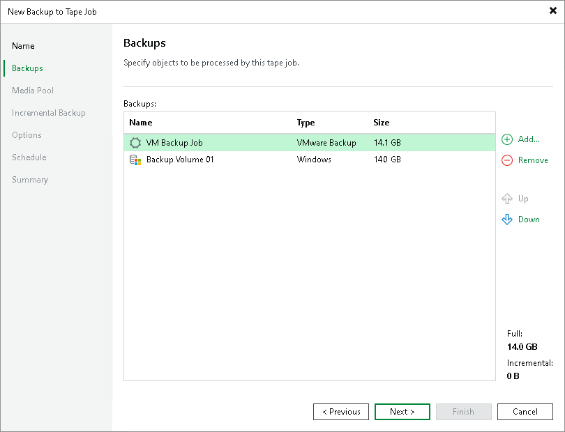
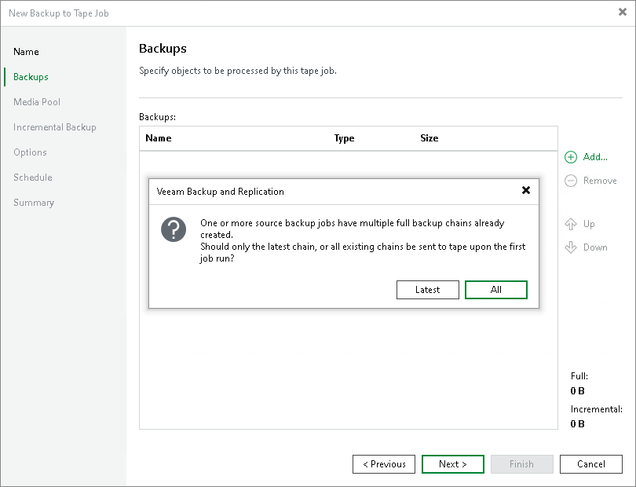

# Step 3. Choose Backups to Archive

In this article

At the Backups step of the wizard, select backups that you want to write to tape with the tape job.

Click Add and select the necessary backups. You can choose backups from the following sources:

* Backup jobs. You can select backups from available backup, backup copy, file share backup or agent backup jobs. When a backup to tape job runs, Veeam Backup & Replication searches and archives restore points from the backups created by the selected backup jobs.
* Backup repositories. Using this option, you can select whole backup repositories. When a backup to tape job runs, Veeam Backup & Replication searches and archives restore points from all backups stored in the chosen backup repositories.

If you choose to archive data from backup repositories, the backup to tape job will process only the backups that were created with backup jobs configured on this Veeam backup server. Imported backups and configuration backups will be skipped from processing.

* Tenants. This option is available for Veeam Cloud Connect service providers. With this option, you can select backups of your tenants or cloud repositories.

To learn more about sources for tape jobs, see [Backup to Tape](backup_to_tape_jobs.md) and [Backup to Tape for Unstructured Data Backups](btt_nas.md).

To remove a source from the list, select it and click Remove on the right.

The sources of the backup to tape job are processed in order the displayed here. To move a source up or down in the list, use the Up and Down buttons on the right.

The total size of full backups added to the backup to tape job is displayed in the Full field. The total size of incremental backups added to the backup to tape job is displayed in the Incremental field. The size of the backup displayed there depends on whether you select to copy all restore points or only the latest backup chain. For more information, see [Selecting Backup Chains to Archive](#selecting_chains).

|  |
| --- |
| Tip |
| This step is optional. You can create a backup to tape job without source. You can add the source later, or you can link this job to a backup job. For more information, see [Linking Backup Jobs to Backup to Tape Jobs](linking_backup_to_backup_to_tape.md). |

Selecting Backup Chains to Archive

On the first run, the tape job can copy all restore points or only the latest backup chain. This option is useful if the source backup job or the source backup repository has several backup chains. The backup chain here means a full backup file plus a set of incremental backup files following it.

To select what backup files you want to archive:

1. Click Add and select Backup jobs or Backup repositories.
2. Select the necessary backup job or repository you want to add to the tape job.
3. Veeam Backup & Replication will display a warning informing about backup chain options. Click Latest to archive only the latest backup chain to tape. This option lets you have only the latest restore points written to tape and use less tape for data archiving. Click All to archive all available backup files.

This option selects what backup chain will be copied on the first run of the job. You can instruct the job to copy only the latest backup chain on every tape job run. This option is available in the advanced settings of the job. For more information, see [Advanced Settings](backup_to_tape_scripts.md).

Page updated 10/20/2025

Page content applies to build 13.0.1.1071
