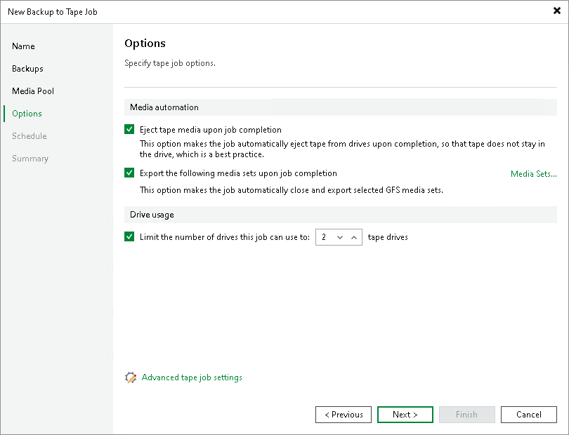

# Options for GFS Job

In this article

This step of the wizard is available if you selected a GFS media pool at the Media Pool step of the wizard. At this step, specify options for automatic operations after finishing the job and the drive usage limit:

* If you want the tape to be automatically ejected from the tape drive and placed into a free tape device slot when the job finishes, select the Eject tape media upon job completion check box.

This option does not prevent the tape job from appending data to this tape. If not configured otherwise in media pool settings, this tape will be placed into a drive on the next tape job run.

* If you want to pull out the tapes with some media sets from the tape device, select the Export the following media sets upon job completion check box. You can use this option, for example, to move tapes to another storage location. The tape device will eject the tapes that belong to the selected media set.

Click Media sets and select the media sets that you want to export.

* If the media pool, which is the target for the tape job, uses parallel processing, you can limit the number of drives to use for processing this tape job. To enable this, select the Limit the number of drives this job can use to N tape drives check box and specify the number of drives to use. For more information on how to enable parallel processing for the media pool, see [Add Optional Media Pool Settings](add_gfs_media_pool_optional.md).
* Click Advanced to configure the advanced job options.

Page updated 7/18/2025

Page content applies to build 13.0.1.1071
