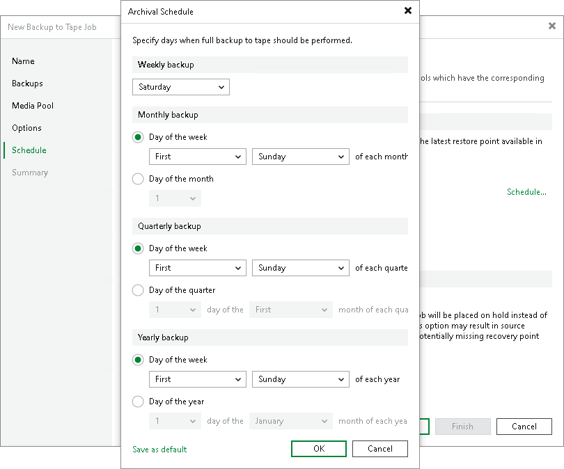
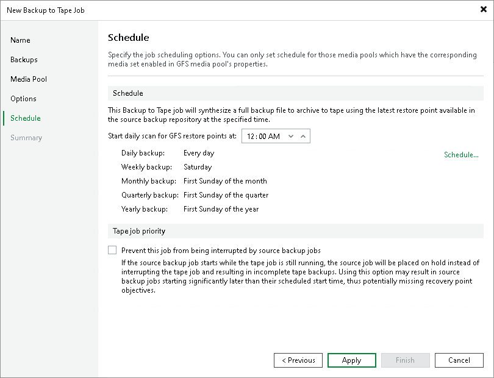

# Schedule for GFS Job

This step of the wizard is available if you selected a GFS media pool at the Media Pool step of the wizard.

Click Schedule to select days for each media set.

|  |
| --- |
| Tip |
| After you specify necessary schedule settings, you can save them as default. To do this, click Save as Default at the bottom left corner of the Archival Schedule window. When you create a new GFS job, Veeam Backup & Replication will automatically apply default settings to the new job schedule. |

In the Start daily scan for GFS restore points at field, specify the time when the GFS job must start. For more details on the GFS job process and scheduling settings, see [How GFS Backup to Tape Works](gfs_to_tape_hiw.md).

Sometimes, the source job may start when the tape job is still running. By default, the source job has priority. In this case, the tape job terminates with error and no data is written to tape. Select the Prevent this job from being interrupted by source backup jobs option if you want to give the tape job a higher priority. If this option is selected, the source job will wait until the tape job finishes. Note that the source job may start with a significant delay.

For tenant to tape jobs, this option is active by default and cannot be disabled.

