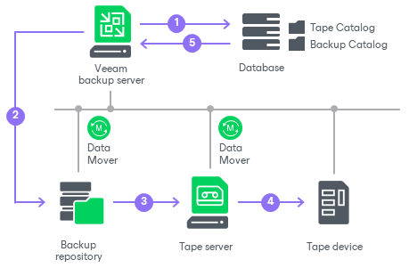

# How Backup to Tape Works

In this article

When Veeam Backup & Replication executes a backup to tape job (started manually or on schedule), it performs the following operations:

1. The backup to tape job addresses the Backup Catalog in the Veeam Backup & Replication database to detect backups that match the job criteria.
2. The files are queued for archiving.
3. Veeam Backup & Replication connects to Veeam Data Movers and starts the data transfer process. The source Veeam Data Mover retrieves data from the backup repository and target Veeam Data Mover sends data to tape.

For backup to tape jobs from [non-direct attached repositories](backup_repository.md), the source Veeam Data Mover starts on the following infrastructure component depending on the [gateway server configuration](gateway_server.md#deployment):

* If the backup repository has automatic gateway selection, the source Veeam Data Mover starts on the tape server.
* If the gateway servers for the backup repository are selected explicitly, Veeam Backup & Replication selects one gateway server from the list and starts the source Veeam Data Mover on it.

1. The tape job addresses the media pool that is set for this job as target. The media pool allots tapes for writing data according to the following configuration options:

* Tapes consumption
* Media sets
* Tape retention

1. While tape recording is performed, Veeam Backup service updates data in the Backup Catalog and Tape Catalog in Veeam Backup database. The Veeam Backup console displays refreshed information about backups archived to tape and shows job statistics.

Page updated 5/21/2025

Page content applies to build 13.0.1.1071
