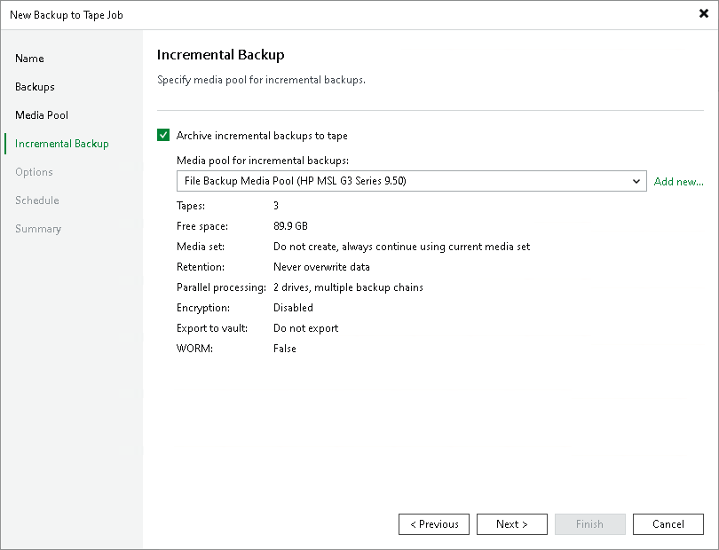

# Step 5. Choose Media Pool for Incremental Backups

In this article

This step is available only if you selected a regular media pool as target for full backups.

At the Incremental Backup step of the wizard, you can enable or disable incremental backups processing and choose media pool for incremental backups.

If you want to back up incremental backups to tape, select the Archive incremental backups to tape check box. If this option is disabled, the backup to tape job will archive only VBK files and will skip VIB files from processing.

From the Media pool for incremental backups list, select a media pool that will be used for incremental backups.

Veeam Backup & Replication allows you to select different media pools for full backups and incremental backups. This can be required if you use different media set or retention settings for archiving full backups and increments.

You cannot select a GFS media pool to copy incremental backups to tape. Instead you can configure a daily media set in the GFS media pool to archive incremental points along with GFS points, combining normal and GFS functionality within a single job. For more details, see [Creating GFS Media Pools](add_gfs_media_pool_set.md).

|  |
| --- |
| Tip |
| If you have not previously created a media pool with the required settings, you can click the Add New button and create a new media pool without closing the job wizard. For more details, see [Creating Media Pools](creating_custom_media_pools.md). |

Page updated 5/20/2025

Page content applies to build 13.0.1.1071
