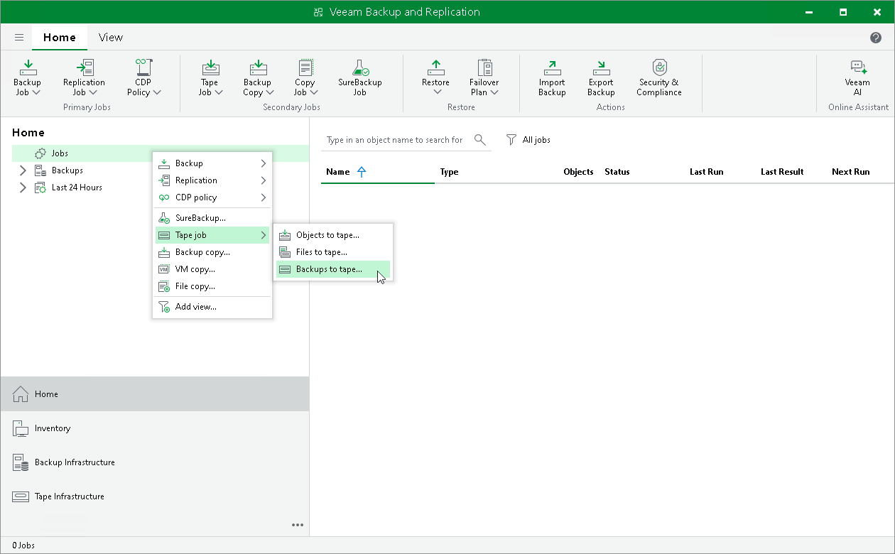

# Step 1. Launch New Backup to Tape Job Wizard

In this article

To run the New Backup to Tape Job wizard, do either of the following:

* On the Home tab, click Tape Job and select Backups.
* Open the Home view, right-click the Jobs node and select Tape Job > Backups to Tape.

Page updated 6/14/2024

Page content applies to build 13.0.1.1071
