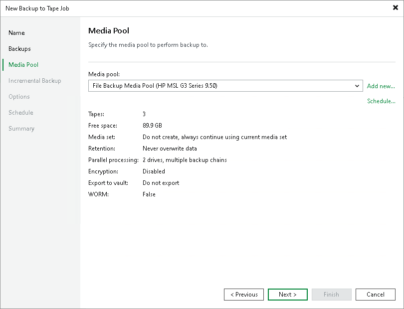
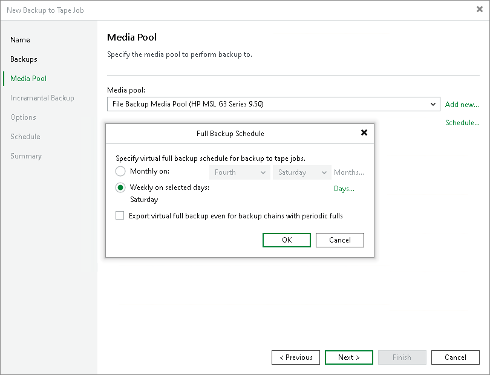

# Step 4. Choose Media Pool for Full Backups

In this article

At the Media Pool step of the wizard, choose media pool for full backups.

1. From the Media pool list, choose a media pool that will be used for archiving full backup files.

You can select a media pool or a GFS media pool. Depending on the selected type, the job schedule will change to regular schedule or GFS schedule.

|  |
| --- |
| Note |
| Free space counter reflects the total remaining free space of all tapes open for appending data. Tapes closed for appending data due to media set settings and retention period are not included into the free space calculation. For tenants backups, you can select only GFS media pools. |

|  |
| --- |
| Tip |
| If you have not previously created a media pool with the required settings, you can click the Add New button and create a new media pool or a GFS media pool without closing the job wizard. For more details, see [Creating Media Pools](creating_custom_media_pools.md) or [Creating GFS Media Pools](creating_gfs_media_pools.md). |

1. The Schedule option is available only if you selected a regular media pool.

In the Full Backup Schedule window, you can enable the virtual full backup and configure its schedule. For more information, see [Virtual Full Backup](virtual_full_backup.md).

Depending on the backup chain type of the source job, there are two possible options:

* If the source job produces a forever incremental backup chain or is a backup copy job without GFS option enabled, Veeam Backup & Replication automatically enables virtual full backups for this job. In this case, the virtual full cannot be switched off. You can configure the virtual full backup schedule at this step of the wizard.
* For the source jobs with other backup chain types, you can enable the virtual full backup manually. Select the Export virtual full backup even for backup chains with periodic fulls checkbox and configure the virtual full backup schedule.

|  |
| --- |
| Note |
| Consider the following:   * If the source job is a backup copy job with the GFS option enabled, Veeam Backup & Replication will not enable virtual full backups for it automatically, as this source job is considered forward incremental. You can enable the virtual full backup for this type of job manually. For more information on methods of creating archive full backups, see [Backup Copy GFS Methods](backup_copy_gfs_modes.md). * The virtual full does not depend on the job settings for incremental backups. If you enable the virtual full for the job, it will be created in any case, no matter whether you enable or do not enable incremental backups. |

Page updated 10/20/2025

Page content applies to build 13.0.1.1071
