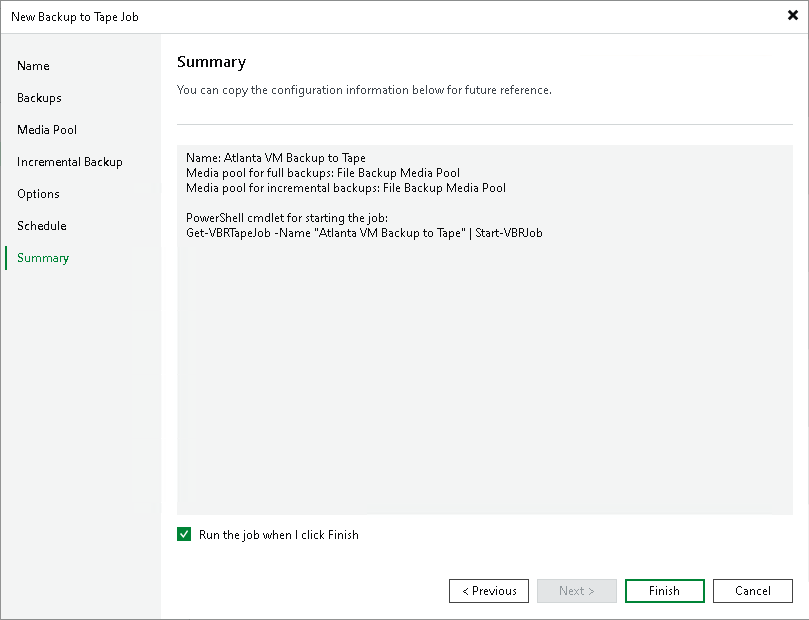

# Step 9. Finish Working with Wizard

In this article

After you have specified schedule settings, click Create. Select the Run the job when I click Finish check box if you want to start archiving backups to tape job right after you complete working with the wizard. Click Finish to close the wizard.

Page updated 5/20/2025

Page content applies to build 13.0.1.1071
