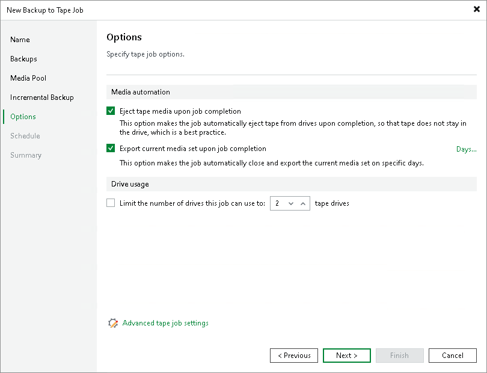

# Options for Backup to Tape Job

In this article

This step of the wizard is available if you selected a regular media pool at the Media Pool step of the wizard.

In the Media Automation section, specify options for automatic operations after finishing the job:

* If you want the tape to be automatically ejected from the tape drive after the job successfully finishes, select the Eject tape media upon job completion check box. The ejected tapes are placed into a free tape device slot.

|  |
| --- |
| Note |
| Consider the following:   * If the job started and failed, the tape will remain in the drive. * The Eject tape media upon job completion check box does not prevent the tape job from appending data to this tape. If not configured otherwise in media pool settings, this tape will be placed into a drive on the next tape job run. For more information, see [Specify Media Set Options](add_media_pool_set.md). |

* If you want to pull out the tapes with the current media set from the tape device, select the Export current media set upon job completion check box. You can use this option, for example, to move tapes to another storage location. The tape device will eject the tapes that belong to the current media set when the media set is closed. Note that with this option selected, a new media set is started after each export.

If you want to export tapes on specific days only (for example, every Saturday), click Days and schedule export on the necessary days.

* If the media pool, which is the target for the tape job, uses parallel processing, you can limit the number of drives to use for processing this tape job. To enable this, select the Limit the number of drives this job can use to N tape drives check box and specify the number of drives to use. For more information on how to enable parallel processing for the media pool, see [Add Optional Media Pool Settings](add_media_pool_encryption.md).
* Click Advanced to configure the advanced job options.

Page updated 7/18/2025

Page content applies to build 13.0.1.1071
