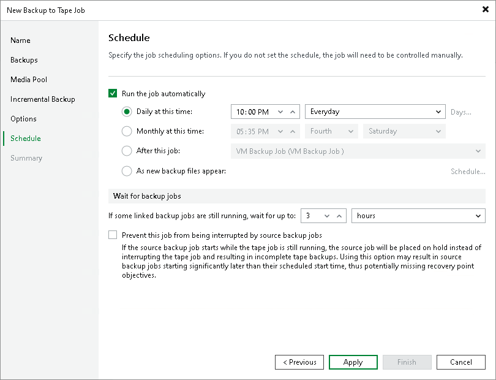

# Schedule for Backup to Tape Job

In this article

This step of the wizard is available if you selected a regular media pool at the Media Pool step of the wizard.

To specify the job schedule, select the Run the job automatically check box. If this check box is not selected, the job is supposed to be started manually.

You can define the following scheduling settings for the job:

* Daily at this time: the tape job will run at specific time on defined days.
* Monthly at this time: the tape job will run at specific time monthly.
* After this job: the tape job will start when a preceding backup job completes. Choose the preceding backup job from the list.

|  |
| --- |
| Note |
| Consider the following:   * This option will only start the tape or backup copy job if the source job is started automatically by schedule. If the source job is started manually, you will choose to start it chained or not. * As the preceding backup job, you cannot select Veeam Agent backup jobs managed by Veeam Agent or standalone Veeam Agent backup jobs, Proxmox VE, Nutanix AHV and oVirt KVM backup jobs. |

* As new backup files appear: the tape job will monitor the source jobs. As soon as the source job creates a new backup, the job will write this backup to tape.

If necessary, you can limit the time when the backup to tape job can start with a schedule. You can restrict start of the backup to tape jobs when backup repositories are busy with other tasks (backup jobs writing to repositories or backup copy jobs reading from repositories). Schedule is set for backup to tape jobs start. Jobs that have started during the allowed time interval will continue working on restricted hours. To define prohibited time for the backup to tape job start, click the Schedule button and define the time when the job is allowed and prohibited to start.

If you have scheduled the job to run at the specific time daily or monthly, consider configuring wait timeout value. Specify the new timeout in the If some linked backup jobs are still running, wait for up to field. When a backup to tape job starts, Veeam Backup & Replication checks the status of the source jobs. If a source job is still writing data to the source repository, the backup to tape job will wait for the specified time interval.

If the timeout period finishes and the source job is still writing data to the source repository, the backup to tape job will terminate and start again at the next scheduled time.

The timeout option is unavailable if you schedule the backup to tape job to start when new backup files appear.

Sometimes, the source job may start when the tape job is still running. This may cause a conflict if the source job needs to perform the following operations:

* Merge of backup files
* Reverse incremental backup transformation
* Compact of full backup file

* Retention Policy maintenance

By default, the source job has priority. In this case, the tape job terminates with error and no data is written to tape. Select the Prevent this job from being interrupted by source backup jobs check box if you want to give the tape job a higher priority. If this option is selected, the tape job will not terminate and will finish writing the data. If the source job needs to perform the listed above operations, it will wait for the tape job to finish. Note that in this case the source job may finish with a significant delay.

|  |
| --- |
| Note |
| If the source job creates per-machine backups, the tape job gets priority for each per-machine restore point separately. In this case, the source job will be able to lock other per-machine restore points and perform the needed operations. Make sure that you set sufficient timeout in the If some linked backup jobs are still running, wait for up to field to avoid the tape job failing. |

Page updated 1/2/2026

Page content applies to build 13.0.1.1071
