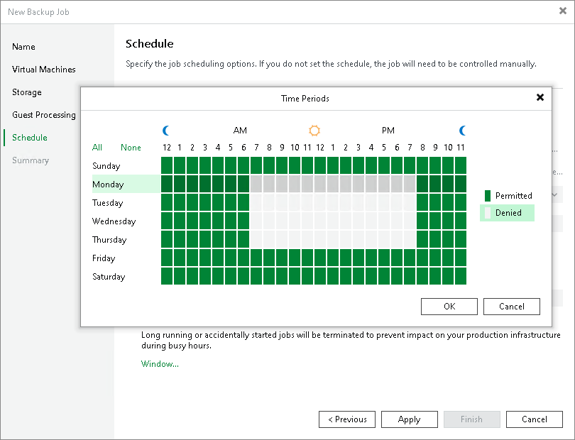
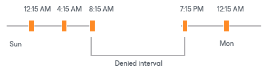

# Backup Window

If necessary, you can specify a backup window for jobs. The backup window is a period of time on weekdays when jobs are permitted to run. If the job exceeds the allowed window, Veeam Backup & Replication will automatically stop this job. Also, if a job is in progress and enters the denied window, Veeam Backup & Replication will stop it immediately and reschedule according to the schedule settings.

The backup window can be helpful if you do not want data protection jobs to produce unwanted overhead for the production environment or do not want jobs to overlap production hours. In this case, you can define the time interval during which the job must not run.

|  |
| --- |
| Important |
| The backup window affects only the data transport process and health check retry operations. Other transformation processes can be performed in the target repository outside the backup window. Linked jobs that process Microsoft SQL transaction logs and Oracle archived logs are not affected by the backup window settings. |

Backup Window for Periodically Run Jobs

If you define the backup window for a job that runs periodically at specific time intervals, Veeam Backup & Replication will immediately start the job after the denied window is over. All subsequent backup job sessions will be performed according to specified scheduling settings.

For example, you have configured a job to run with a 4-hour interval with an offset of 15 minutes. The allowed backup window for the job is 7:00 PM to 8:00 AM. Veeam Backup & Replication will run this job in the following way:

1. The first job session will start at 12:15 AM (since midnight is a reference time for periodically run jobs).
2. The next job session will start at 4:15 AM.
3. The job session at 8:15 AM will not be performed as it falls into the denied period of the backup window.
4. The next job session will start immediately after the denied period is over: at 7:15 PM.
5. After that, Veeam Backup & Replication will run the job according to the defined schedule: at 8:15 PM, 12:15 AM and so on.

