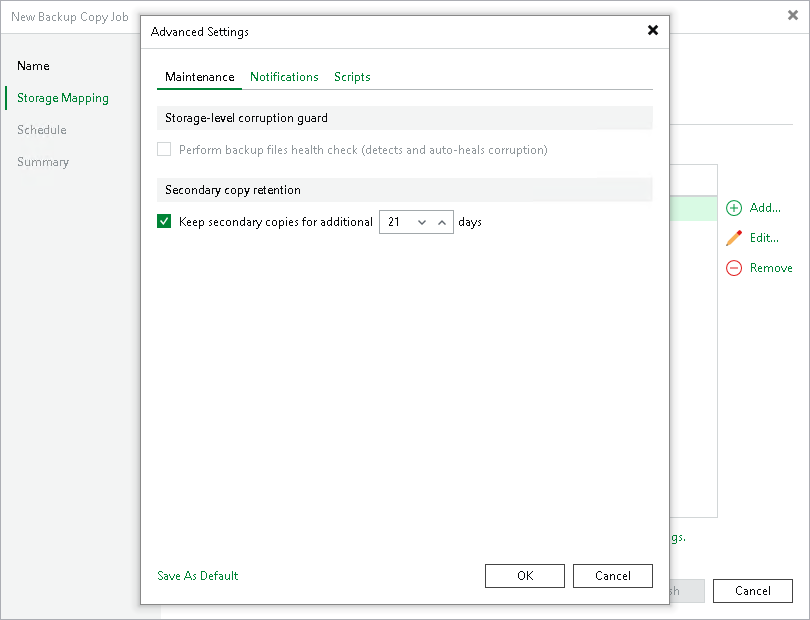

# Maintenance Settings

In the maintenance settings, you can configure whether to perform a health check and after which period delete from the target HPE StoreOnce repository files deleted from the source repository. Note that the health check may lower the performance of the target repository. For details, see [Health Check for Backup Files](backup_copy_health_check.md#storeonce).

1. At the Storage Mapping step of the wizard, click Advanced Job Settings.
2. In the Keep secondary copies for additional field, specify after which period of time Veeam Backup & Replication will delete files from the target repository once they have been deleted from the source repository.

The backup copy job waits the specified number of days since the backup file creation on the source repository and after deletes the backup files from the target repository.  If the specified number of days has already passed at the moment of deletion, the backup copy job deletes the backup file immediately.

For example, if the option is set to 30 days and the backup file on the source repository is deleted after 15 days, Veeam Backup & Replication will keep the backup file on the target repository for an additional 15 days.

1. If you want to save this set of settings as the default one, click Save as default. When you create a new job, the saved settings will be offered as the default. This also applies to all users added to the backup server.

