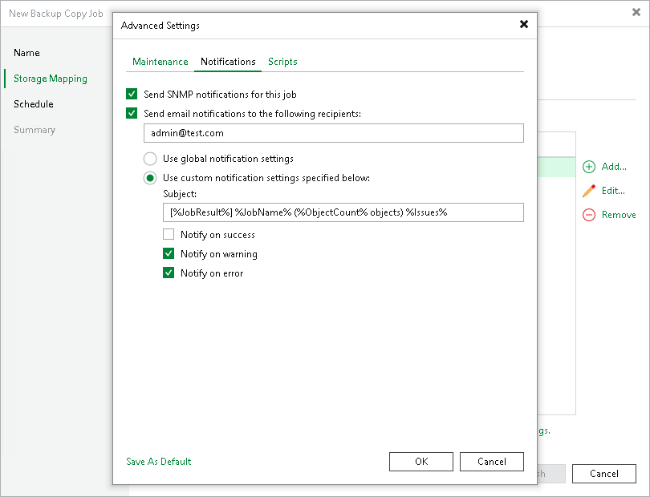

# Notification Settings

To specify notification settings for the backup copy job:

1. At the Storage Mapping step of the wizard, click Advanced.
2. Click the Notifications tab.
3. Select the Send SNMP notifications for this job check box if you want to receive SNMP traps when data from each source repository is copied.

SNMP traps will be sent if you specify global SNMP settings in Veeam Backup & Replication and configure software on the recipient machine to receive SNMP traps. For more information, see [Specifying SNMP Settings](snmp_settings.md).

1. Select the Send email notifications to the following recipients check box if you want to receive email notifications when copying data of each source repository finishes with Success, Warning or Failed status.

Email notifications will be sent if you configure global email notification settings in Veeam Backup & Replication. For more information, see [Configuring Global Email Notification Settings](general_email_notifications.md).

1. You can choose whether to use global notification settings or specify custom notification settings.

+ To receive typical notifications for the job, select Use global notification settings. In this case, Veeam Backup & Replication will apply to the job global email notification settings specified for the backup server.
+ To configure custom notifications, select Use custom notification settings specified below. You can specify the following notification settings:

1. In the Subject field, specify a notification subject. You can use the following variables in the subject: %Time% (completion time), %JobName%, %JobResult%, %VmCount% (number of machines in the job) and %Issues% (number of machines in the job that have been processed with the Warning or Failed status).
2. Select the Notify on success, Notify on warning and Notify on error check boxes to receive email notifications if data processing completes successfully, fails or completes with a warning.

1. If you want to save this set of settings as the default one, click Save as default. When you create a new job, the saved settings will be offered as the default. This also applies to all users added to the backup server.

