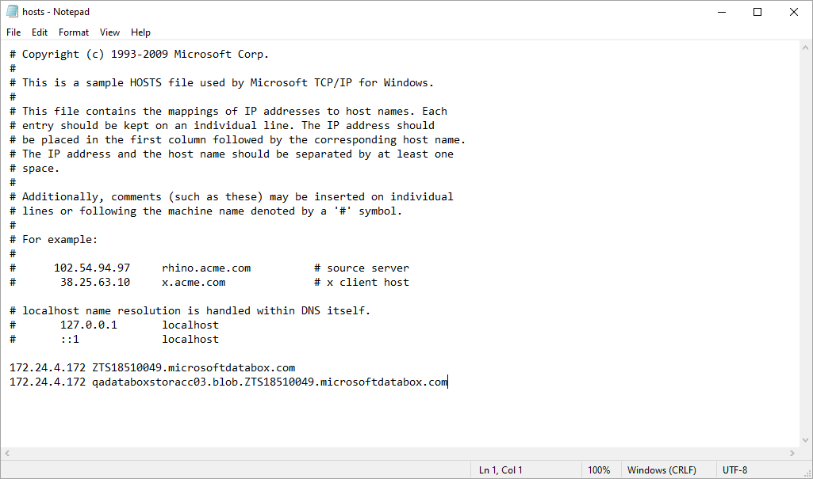
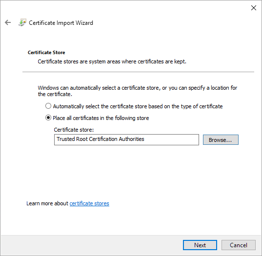

# Before You Begin

Before you add Microsoft Azure Data Box to the backup infrastructure, complete the following steps:

* [Configure Name Resolutions](#cnr)
* [Download and Install SSL Certificate](#iac)

Configuring Name Resolutions

To resolve a DNS name of your Azure Data Box device, make sure to add the following DNS addresses to the HOST file that is located on both the Veeam Backup & Replication server and the gateway server (if any additional gateway server is used):

* <ip\_address> <mydataboxno>.microsoftdatabox.com
* <ip\_address> <storageaccountname>.blob.<mydataboxno>.microsoftdatabox.com

For more information on how to learn the values for <ip\_address>, <mydataboxno> and <storageaccountname>, see [Microsoft Docs](https://docs.microsoft.com/en-us/azure/databox/data-box-deploy-copy-data-via-rest).

As an <ip\_address>, use any of the IP addresses listed under the Data N section. You can also use the address specified under the MGMT section, but due to its slow connection rate (limited to 1 GbE), using such an address is not recommended.

The following is an example of the HOST file.

|  |
| --- |
| Note |
| Consider the following:   * Make sure to configure name resolutions on each server that may be used as a gateway. * Alternatively, you can create a microsoftdatabox.com DNS zone with necessary records on your DNS server if you prefer not to modify the HOST file. |

Downloading and Installing SSL Certificate

To establish a secure connection to the Azure Data Box device, make sure to download and import an SSL certificate and install it on both the Veeam Backup & Replication server and the gateway server (if any additional gateway server is used).

For more information on how to download an SSL certificate, see [Microsoft Docs](https://docs.microsoft.com/en-us/azure/databox/data-box-deploy-copy-data-via-rest#connect-via-https).

When installing a certificate, do the following:

1. In the Certificate Import Wizard dialog box, select Local Machine.
2. In the Certificate Store step, select Place all certificates in the following store and click Browse.
3. Select Trusted Root Certification Authorities.

Configuring registry settings

For information how to configure registry settings for Microsoft Azure Data Box device, see [this Veeam KB article](https://www.veeam.com/kb4101).

Sizing Gateway Server

Consider that Veeam Backup & Replication supports Azure Data Box devices that are capable of reading/writing data using REST API only; the Azure Data Box Disk type is not supported.

As with any other object storage, REST API performance depends on scale. As Azure Data Box is a single endpoint, the individual throughput of this REST API may be limited. The block size used in Veeam Backup & Replication capacity tier for object storage offload matches that of the source job. The default object size will be a compressed 1 MB block, resulting in objects of around 512 KB in size.

Data offload speed capabilities depend on the Azure Data Box devices:

* Azure Data Box 80 TiB: Data offload speed can reach up to 300 MB/s.
* Azure Data Box Next Gen 120 TB: Data offload speed can reach up to 600 MB/s.

For optimal performance, it is recommended to use a dedicated gateway server equipped with at least 8 CPU cores.

Related Topics

[Gateway Servers](gateway_server.md)

