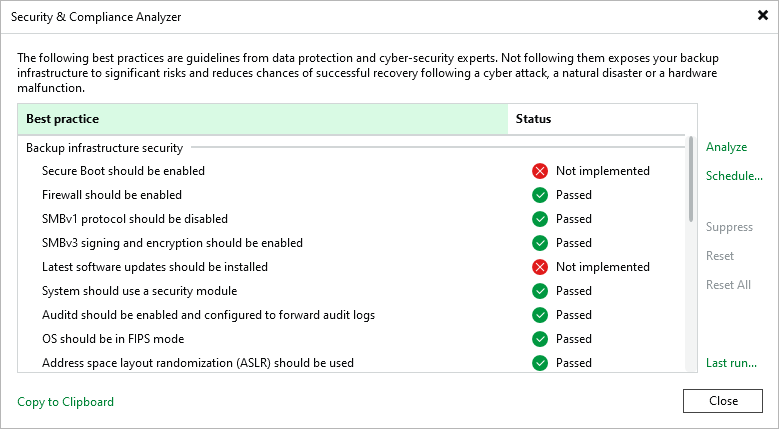
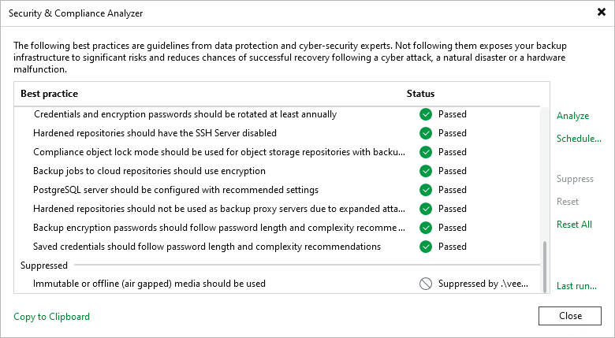
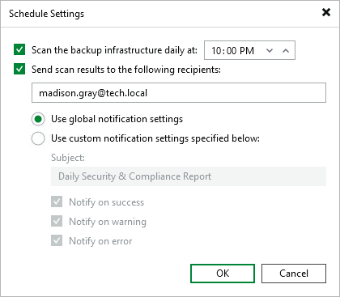
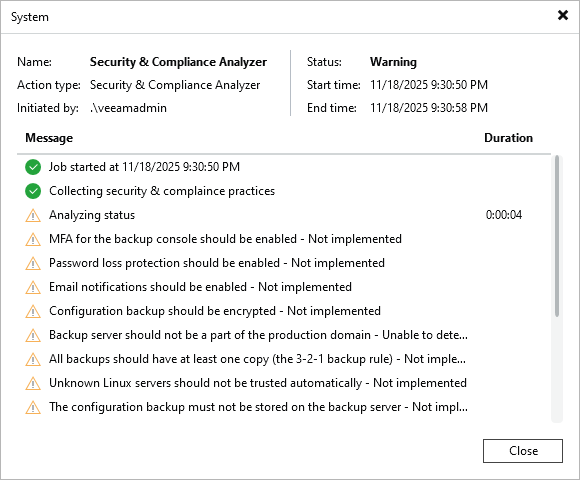

# Security & Compliance Analyzer

The Veeam Backup & Replication console provides a built-in tool to ensure that your backup server configuration follows security best practices for Veeam backup infrastructure components based on Microsoft Windows Server and Linux operating systems.

|  |
| --- |
| Note |
| Full functionality of Security & Compliance Analyzer is available in the desktop application. In the Veeam Backup & Replication Web UI, you can only view scan results. For more information, see [Viewing Scan Results](#view_results). |

To perform a security check, select the Home tab and click Security & Compliance on the ribbon. After that, the Security & Compliance Analyzer window opens and the security check starts automatically.

Configuration parameters that have recommended settings will have the Passed status. Parameters that have the Not implemented status should be revised in terms of your backup infrastructure. You can [set them up as recommended](#recommendations_for_configuration_parameters) or [exclude specific parameters from the checklist](#excluding_parameters).

|  |
| --- |
| Tip |
| Run the Security & Compliance Analyzer regularly, especially after you make significant changes to your backup infrastructure. To configure scan scheduling, see [this section](#scan_scheduling). |

Configuration Parameters

Security & Compliance Analyzer checks configuration parameters both for the operating system and Veeam products.

Parameters for Veeam Backup & Replication on Linux

Parameters for Veeam Backup & Replication on Linux

| Parameter | Check Condition | Notes |
| Backup Infrastructure Security | | |
| Secure Boot should be enabled | The command mokutil -sb--state returns SecureBoot enabled. | To reduce the risk of rootkits compromising the system, the UEFI Secure Boot should be enabled on the machine where Veeam Backup & Replication is installed. |
| Firewall should be enabled | The command systemctl is-enabled firewalld returns status enabled.  The command systemctl is-active firewalld returns status active. | The firewall should be turned on. Also, rules for inbound and outbound connections should be configured according to your infrastructure and security best practices. |
| SMBv1 protocol should be disabled | The command testparm -s returns server min protocol = SMB2 | Outdated network protocol SMB 1.0 should be disabled as it has a number of serious security vulnerabilities including remote code execution. |
| SMBv3 signing and encryption should be enabled | The command testparm -s returns the following:   * server signing = required * server smb encrypt = required | If SMB shares are used in the backup infrastructure, SMB signing and encryption should be enabled to prevent NTLMv2 relay attacks. |
| Latest software updates should be installed | There are no pending security updates in Veeam Updater. | Veeam Software Appliance components should be updated regularly. Security updates contain fixes that reduce the risk of compromise.  If this check fails, a list of pending updates can be found in the log files. For more information, see [Managing Logs](logging.md).  You can include pending optional updates in this check. To do this, set the SCASoftwareUpdatesIncludeOptional parameter to 1 in the /etc/veeam/veeam\_backup\_and\_replication.conf file. For more information, see [Performing Maintenance Tasks](hmc_perform_maintenance_tasks.md#config). |
| System should use a security module | The command sestatus returns SELinux status enabled. | The Security-Enhanced Linux (SELinux) module should be enabled to ensure the integrity of the system and reduce the risk of compromise. |
| Audits should be enabled and configured to forward audit logs | The command systemctl is-enabled auditd returns status enabled.  The command systemctl is-active auditd returns status active.  The command auditctl -l returns the list of loaded audit rules. | To ensure that the system is properly monitored, the Linux audit system should be enabled and configured with log forwarding. |
| OS should be in FIPS mode | The command sysctl -n -b crypto.fips\_enabled returns 1. | The Linux operating system should run in a FIPS-compliant operation mode. For more information, see [FIPS Compliance](fips_compliance.md). |
| Address space layout randomization (ASLR) should be used | The command sysctl -n -b kernel.randomize\_va\_space returns 2. | To reduce the risk of compromise, program data should be stored in random memory locations. |
| OS should be configured to use TCP syncookies | The command sysctl -n -b net.ipv4.tcp\_syncookies returns 1. | SYN cookies should be used to reduce the impact of SYN flood denial-of-service attacks. They allow the system to accept valid connections, even if the half-open connection queue is full. |
| World-writable directories should not be executable | The command find / -type d -perm o+w -perm -o+x 2> /dev/null returns empty values.  The following directories are checked:   * /bin/ * /user/bin/ * /etc/ * /home/ * /var/ (excluding var/tmp and /var/lib/veeam/dump) | World-writable directories should not be executable as they can be modified by any user on the system and are vulnerable to malicious actors. |
| Services with known issues should be disabled | The following commands do not return enabled:   * systemctl is-enabled rlogin.socket * systemctl is-enabled telnetd * systemctl is-enabled rsh.socket   The following commands do not return active:   * systemctl is-active rlogin.socket * systemctl is-active telnetd * systemctl is-active rsh.socket | The rlogin, telnetd, and rsh-server services should be disabled as they have a number of known security vulnerabilities. |
| Local accounts credentials should follow password length and complexity recommendations | Linux credentials meet the following requirements for password length and complexity:   * 15 characters minimum * 1 upper case character * 1 lower case character * 1 numeric character * 1 special character | Using strong passwords minimizes the risk of unauthorized access. |
| Audit binaries should be owned by root | The following commands return 1:   * find %auditbinaryfilepath% -type f -not -user root | grep -q . * find %auditbinaryfilepath% -type f -not -group root | grep -q .   The following directories are checked:   * /sbin/auditctl * /sbin/aureport * /sbin/ausearch * /sbin/autrace * /sbin/auditd * /sbin/rsyslogd * /sbin/augenrules | Access to the audit binaries should be restricted to prevent unauthorized changes that may affect system performance or result in incomplete event logging. |
| Product Configuration | | |
| MFA for the backup console should be enabled | In the Users and Roles > Security settings, the Enable multi-factor authentication (MFA) check box is selected. | Multi-factor authentication (MFA) should be enabled for the Veeam Backup & Replication console to protect user accounts with additional user verification. For more information, see [Multi-Factor Authentication](mfa.md). |
| Immutable or offline (air gapped) media should be used | At least one of the following components is added to the Veeam Backup & Replication console and actively used:   * Backup repository with enabled immutability * Backup repository with rotated drives * Tape device | Immutable repositories should be used to protect backup files from being modified or deleted. For more information, see [Immutability](immutability.md).  Offline media should be used to keep backup files in addition to virtual storage devices. For more information, see [Backup Repositories with Rotated Drives](backup_repository_rotated.md) and [Tape Devices Support](tape_device_support.md). |
| Password loss protection should be enabled | In Veeam Backup Enterprise Manager settings, the Enable encryption password loss protection check box is selected. | Password loss protection should be enabled on Veeam Backup Enterprise Manager to provide an alternative way to decrypt the data if a password for encrypted backup or tape is lost. For more information, see [Managing Encryption Keys](https://helpcenter.veeam.com/docs/vbr/em/em_manage_keys.html?ver=13). |
| Backup server should not be a part of the production domain | The command realm list | grep domain-name returns an empty value. | For large environments, it is recommended to add the backup server and other backup infrastructure components to a management domain in a separate Active Directory forest. For medium-sized and small environments, backup infrastructure components can be placed to a separate workgroup.  This parameter will have the Passed status only if the backup server is not joined to any domain. In other cases, it will have the Unable to detect status because there is no way to identify the production domain automatically. |
| Email notifications should be enabled | In the global email notification settings, the Enable e-mail notifications check box is selected. | Email notifications should be enabled to monitor job statuses. For more information, see [Specifying Email Notification Settings](email_notification_settings.md). |
| All backups should have at least one copy (the 3-2-1 backup rule) | At least one of the following jobs or components exists in the Veeam Backup & Replication console:   * Backup copy job * Scale-out backup repository with the copy mode * Archive Tier | To be compliant with the 3-2-1 rule, at least one backup copy job should be created, or a scale-out backup repository with the copy mode or archive tier should be added. For more information, see [Plan How Many Copies of Data You Need (3-2-1 rule)](planning.md#step4). |
| Reverse incremental backup mode is deprecated and should be avoided | In the backup job settings, the incremental backup method is selected. | The reverse incremental backup method should not be used as it produces the heaviest I/O impact on the backup storage compared to other backup methods. For more information, see [Backup Methods](backup_methods.md). |
| Unknown Linux servers should not be trusted automatically | In the Options > Security settings, the Add unknown hosts to the list manually option is selected in the Linux hosts authentication section. | Untrusted Linux VMs and Linux servers must be allowed to connect to the backup server only using manual SSH fingerprint verification. For more information, see [Linux Host Authentication](linux_fingerprint_check.md). |
| The configuration backup must not be stored on the backup server | In the configuration backup settings, the default backup repository or any other folder on the backup server are not selected as target backup repository. | The configuration backup must not be stored on the backup server or on the default backup repository to be able to recover its configuration in case of failure. For more information, see [Configuration Backup](export_vbr_config.md). |
| Host to proxy traffic encryption should be enabled for the Network transport mode | For VMware backup proxy that is used the Network transport mode, the Enable host to proxy traffic encryption in Network mode (NBDSSL) check box is selected. | If a VMware backup proxy uses the Network transport mode, it is recommended to transfer VM data over an encrypted TLS connection. For more information about this configuration and its limitations, see [Choose Server](vmware_proxy_server.md). |
| Hardened repositories should not be hosted in virtual machines | The hardened repository added to the Veeam Backup & Replication console is not hosted on a virtual machine. | To reduce the attack surface, the hardened repository should be hosted on a physical machine with local storage. For more information about hardened repository requirements, see [Requirements and Limitations](hardened_repository_limitations.md). |
| Network traffic encryption should be enabled in the backup network | All global network traffic rules have the Encrypt network traffic check box selected. | Network traffic encryption should be enabled in the backup network to ensure secure communication of sensitive data not only between public networks but also between private ones. For more information, see [Enabling Traffic Encryption](enable_network_encryption.md). |
| Linux servers should have password-based authentication disabled | Linux servers added to the Veeam Backup & Replication console do not use standard accounts. | Key-based SSH authentication is generally considered more secure than password-based authentication. The private key is not passed to the server and cannot be captured even if a user connects to a fake server and accepts a bad fingerprint. This helps averting man-in-the-middle (MITM) attacks. |
| Configuration backup should be enabled and use encryption | In the configuration backup settings, the following check boxes are selected:   * The Enable configuration backup to the following repository check box. * The Enable configuration backup file encryption check box. | Configuration backup should be enabled to reduce the risk of data loss and manage the Veeam Backup & Replication configuration database easier. For more information, see [Configuration Backup and Restore](vbr_config.md).  Data encryption for configuration backup should be enabled to secure sensitive data stored in the configuration database. For more information, see [Creating Encrypted Configuration Backups](config_backup_encrypted.md). |
| Credentials and encryption passwords should be rotated at least annually | Passwords of the user accounts added to the Credentials Manager, Cloud Credentials Manager, and Password Manager were changed less than 365 days ago. | For all user accounts added to the [Credentials Manager](credentials_manager.md), [Cloud Credentials Manager](cloud_credentials.md) and [Password Manager](password_manager.md), passwords should be changed at least once a year. |
| Hardened repositories should have the SSH Server disabled | Hardened repositories added to the Veeam Backup & Replication console are not available through SSH connection. | SSH connection is necessary only for the deployment of Veeam Data Mover. For security purposes, after adding the hardened repository to the backup infrastructure, the SSH connection should be disabled for the user account used to connect to the Linux server or for the server itself. |
| Compliance mode should be used for repositories with backup immutability enabled | Immutable object storage and Dell Data Domain repositories added to the Veeam Backup & Replication console use the Compliance retention mode. | The Compliance retention mode should be used for [Dell Data Domain](dell_dd.md) repositories and object storage repositories with immutability enabled. This is a more secure option compared to the Governance retention mode. For more information about immutability for object storage repositories see [this section](immutability_object_storage_repositories.md). For more information about retentions modes, see [this Amazon article](https://docs.aws.amazon.com/AmazonS3/latest/userguide/object-lock-overview.html#object-lock-retention-modes). |
| Backup jobs to cloud repositories should use encryption | In the backup job settings, if the cloud repository is selected as a backup repository, the Enable backup file encryption check box is also selected. | To reduce the cloud attack surface, job-level encryption should be enabled. For more information, see [Job Encryption](encryption_job.md). |
| PostgreSQL server should be configured with recommended settings | In the postgresql.conf file, the following parameters have specific values:   * max\_connections = 3000 * max\_wal\_senders = 0 | PostgreSQL should have optimal run-time settings to operate correctly.  For more information about configuration file, see [PostgreSQL documentation](https://www.postgresql.org/docs/16/config-setting.html#CONFIG-SETTING-CONFIGURATION-FILE). |
| Hardened repositories should not be used as backup proxy servers due to expanded attack surface | The hardened repository added to the Veeam Backup & Replication console is not used as a VMware backup proxy. | A VMware backup proxy requires VMware VDDK components to be installed. To reduce the risk of attacks through VMware VDDK vulnerabilities, a hardened repository should have only one role assigned.  For more information about hardened repositories, see [Hardened Repository](hardened_repository.md). |
| High Availability cluster should be configured for this backup server | The backup server is added to a High Availability cluster. | High Availability should be enabled to ensure continuous availability and to minimize backup server downtime by clustering two backup nodes. |
| Backup encryption passwords should follow length and complexity recommendations | [Encryption passwords](password_manager.md) meet the following requirements for length and complexity:   * 12 characters minimum * 1 upper case character * 1 lower case character * 1 numeric character * 1 special character | Using strong encryption passwords minimizes the risk of unauthorized access. |
| Saved credentials should follow password length and complexity recommendations | Third-party credentials meet the following requirements for password length and complexity:   * 12 characters minimum * 1 upper case character * 1 lower case character * 1 numeric character * 1 special character | Using strong passwords for third-party services added to Veeam Backup & Replication minimizes the risk of unauthorized access. |

Parameters for Veeam Backup & Replication on Microsoft Windows

Parameters for Veeam Backup & Replication on Microsoft Windows

| Parameter | Check Condition | Notes |
| Backup Infrastructure Security | | |
| Remote Desktop Services (TermService) should be disabled | The Remote Desktop Services service is not running. The Startup type parameter is set to Disabled. | Remote services should be disabled if they are not needed. Note that for the Veeam Cloud Connect infrastructure, this parameter must be enabled if the SP uses Remote Desktop Protocol (RDP) to connect to the tenant backup server. For more information, see [Remote Desktop Connection to Tenant](https://helpcenter.veeam.com/docs/vbr/cloud/cloud_connect_remote_desktop.html?ver=13). |
| Remote Registry service (RemoteRegistry) should be disabled | The Remote Registry service is not running. The Startup type parameter is set to Disabled. | Remote services should be disabled if they are not needed. |
| Windows Remote Management (WinRM) service should be disabled | The Windows Remote Management (WS-Management) service is not running. The Startup type parameter is set to Disabled. | Remote services should be disabled if they are not needed. |
| Windows Firewall should be enabled | The following PowerShell command returns True for Domain, Public, and Private firewall profiles:  Get-NetFirewallProfile | Format-Table Name, Enabled | Microsoft Defender Firewall with Advanced Security should be turned on. Also, rules for inbound and outbound connections should be configured according to your infrastructure and Microsoft best practices. For more information, see [this Microsoft article](https://learn.microsoft.com/en-us/windows/security/threat-protection/windows-firewall/best-practices-configuring). |
| WDigest credentials caching should be disabled | The value of the HKLM\System\CurrentControlSet\Control\SecurityProviders\WDigest\UseLogonCredential registry key is set to 0. | WDigest credentials caching stores cleartext credentials in Windows RAM. To reduce the risk of credential dumping attacks, the setting should be disabled with a registry value. For more information, see [this Microsoft article](https://support.microsoft.com/en-us/topic/microsoft-security-advisory-update-to-improve-credentials-protection-and-management-may-13-2014-93434251-04ac-b7f3-52aa-9f951c14b649). |
| Web Proxy Auto-Discovery service (WinHttpAutoProxySvc) should be disabled | The WinHTTP Web Proxy Auto-Discovery service is not running. The Startup type parameter is set to Disabled.  The value of the HKLM\SOFTWARE\Microsoft\Windows\CurrentVersion\Internet Settings\WinHttp\DisableWpad registry key is set to 1. | The Web Proxy Auto-Discovery (WPAD) protocol provides automatic discovery of web proxy configuration. If this feature is not used in the backup infrastructure, the WinHTTP Web Proxy Auto-Discovery Service should be disabled to prevent man-in-the-middle (MITM) attacks. |
| Deprecated versions of SSL and TLS should be disabled | Values of the following registry keys are set to 1:   * HKLM\SYSTEM\CurrentControlSet\Control\SecurityProviders\SCHANNEL\Protocols\SSL 2.0\Client\DisabledByDefault * HKLM\SYSTEM\CurrentControlSet\Control\SecurityProviders\SCHANNEL\Protocols\SSL 2.0\Server\DisabledByDefault * HKLM\SYSTEM\CurrentControlSet\Control\SecurityProviders\SCHANNEL\Protocols\SSL 3.0\Client\DisabledByDefault * HKLM\SYSTEM\CurrentControlSet\Control\SecurityProviders\SCHANNEL\Protocols\SSL 3.0\Server\DisabledByDefault * HKLM\SYSTEM\CurrentControlSet\Control\SecurityProviders\SCHANNEL\Protocols\TLS 1.0\Client\DisabledByDefault * HKLM\SYSTEM\CurrentControlSet\Control\SecurityProviders\SCHANNEL\Protocols\TLS 1.0\Server\DisabledByDefault * HKLM\SYSTEM\CurrentControlSet\Control\SecurityProviders\SCHANNEL\Protocols\TLS 1.1\Client\DisabledByDefault * HKLM\SYSTEM\CurrentControlSet\Control\SecurityProviders\SCHANNEL\Protocols\TLS 1.1\Server\DisabledByDefault   Values of the following registry keys are set to 0:   * HKLM\SYSTEM\CurrentControlSet\Control\SecurityProviders\SCHANNEL\Protocols\SSL 2.0\Client\Enabled * HKLM\SYSTEM\CurrentControlSet\Control\SecurityProviders\SCHANNEL\Protocols\SSL 2.0\Server\Enabled * HKLM\SYSTEM\CurrentControlSet\Control\SecurityProviders\SCHANNEL\Protocols\SSL 3.0\Client\Enabled * HKLM\SYSTEM\CurrentControlSet\Control\SecurityProviders\SCHANNEL\Protocols\SSL 3.0\Server\Enabled * HKLM\SYSTEM\CurrentControlSet\Control\SecurityProviders\SCHANNEL\Protocols\TLS 1.0\Client\Enabled * HKLM\SYSTEM\CurrentControlSet\Control\SecurityProviders\SCHANNEL\Protocols\TLS 1.0\Server\Enabled * HKLM\SYSTEM\CurrentControlSet\Control\SecurityProviders\SCHANNEL\Protocols\TLS 1.1\Client\Enabled * HKLM\SYSTEM\CurrentControlSet\Control\SecurityProviders\SCHANNEL\Protocols\TLS 1.1\Server\Enabled | Outdated network protocols SSL 2.0 and 3.0 should be disabled as they have well-known security vulnerabilities and are not NIST-approved. Also, TLS 1.0 and 1.1 should be disabled if they are not needed. For more information, see [NIST guidelines](https://csrc.nist.gov/publications/detail/sp/800-52/rev-2/final).  This parameter will have the Passed or Not implemented status only if specific registry keys with specific values exist. For more information, see [this Microsoft article](https://learn.microsoft.com/en-us/windows-server/security/tls/tls-registry-settings?tabs=diffie-hellman#tls-dtls-and-ssl-protocol-version-settings). If the registry key does not exist, the parameter will have the Unable to detect status.  If the registry key existence cannot be checked for some reason, the parameter will also have the Not implemented status. |
| Windows Script Host should be disabled | The value of the HKLM\SOFTWARE\Microsoft\Windows Script Host\Settings\Enabled registry key is set to 0. | Windows Script Host should be disabled to prevent script-based malware attacks.  Consider the following:   * Make sure that this service is not used by backup infrastructure components you plan to install on the backup server. If there are any (for example, PostgreSQL database), install these components first, then disable the service. To update these components, you need to enable the service temporarily. * To run specific verification scripts, you need to enable the service. For more information, see [Custom Verification Scripts](custom_verification_scripts.md). |
| SMBv1 protocol should be disabled | The following PowerShell command returns False:  Get-SmbServerConfiguration | Select EnableSMB1Protocol | Outdated network protocol SMB 1.0 should be disabled as it has a number of serious security vulnerabilities including remote code execution. For more information, see [this Microsoft article](https://techcommunity.microsoft.com/t5/storage-at-microsoft/stop-using-smb1/ba-p/425858). |
| Link-Local Multicast Name Resolution (LLMNR) should be disabled | The HKLM\SOFTWARE\Policies\Microsoft\Windows NT\DNSClient\EnableMultiCast registry key exists. The value of the key is set to 0. | Outdated broadcast protocol Link-Local Multicast Name Resolution (LLMNR) should be disabled to prevent spoofing and man-in-the-middle (MITM) attacks.  Note that this parameter will have the Passed or Not implemented status only if specific registry keys with specific values exist. If the registry key does not exist, the parameter will have the Unable to detect status.  If the registry key existence cannot be checked for some reason, the parameter will also have the Not implemented status. |
| SMBv3 signing and encryption should be enabled | The following PowerShell command returns True for all specified parameters:  Get-SmbServerConfiguration | select RequireSecuritySignature, EncryptData, EnableSecuritySignature | If SMB shares are used in the backup infrastructure, SMB signing and encryption should be enabled to prevent NTLMv2 relay attacks. For more information, see these Microsoft articles: [Configure SMB Signing with Confidence](https://techcommunity.microsoft.com/t5/storage-at-microsoft/configure-smb-signing-with-confidence/ba-p/2418102), [SMB security enhancements](https://learn.microsoft.com/en-us/windows-server/storage/file-server/smb-security). |
| Credentials Guard should be configured | Credential Guard registry keys are configured as follows:   * The value of the HKLM\SYSTEM\CurrentControlSet\Control\DeviceGuard\EnableVirtualizationBasedSecurity registry key is set to 1. * The value of the HKLM\SYSTEM\CurrentControlSet\Control\DeviceGuard\RequirePlatformSecurityFeatures registry key is set to 1 or 3. * The value of the HKLM\SYSTEM\CurrentControlSet\Control\Lsa\LsaCfgFlags registry key is set to 1 or 2. | Credential Guard should be configured properly to prevent credential theft attacks. For more information on Credential Guard, see [this Microsoft article](https://learn.microsoft.com/en-us/windows/security/identity-protection/credential-guard/).  If the registry key existence cannot be checked for some reason, the parameter will also have the Not implemented status. |
| Local Security Authority Server Service (LSASS) should be set to run as a protected process | The value of the HKLM\SYSTEM\CurrentControlSet\Control\Lsa\RunAsPPL registry key is set to 1 or 2. | The protection for the Local Security Authority (LSA) process should be configured properly to prevent code injection and credential theft attacks. For more information, see [this Microsoft article](https://learn.microsoft.com/en-us/windows-server/security/credentials-protection-and-management/configuring-additional-lsa-protection).  If the registry key existence cannot be checked for some reason, the parameter will also have the Not implemented status. |
| NetBIOS protocol should be disabled on all network interfaces | The value of HKLM\SYSTEM\CurrentControlSet\Services\NetBT\Parameters\Interfaces\Tcpip\_{GUID}\NetbiosOptions registry keys is set to 2. | NetBIOS should be disabled to reduce the risk of data theft attacks through shared folders.  If the registry key existence cannot be checked for some reason, the parameter will also have the Not implemented status. |
| Product Configuration | | |
| MFA for the backup console should be enabled | In the Users and Roles > Security settings, the Enable multi-factor authentication (MFA) check box is selected. | Multi-factor authentication (MFA) should be enabled for the Veeam Backup & Replication console to protect user accounts with additional user verification. For more information, see [Multi-Factor Authentication](mfa.md). |
| Immutable or offline (air gapped) media should be used | At least one of the following components is added to the Veeam Backup & Replication console and actively used:   * Backup repository with enabled immutability * Backup repository with rotated drives * Tape device | Immutable repositories should be used to protect backup files from being modified or deleted. For more information, see [Immutability](immutability.md).  Offline media should be used to keep backup files in addition to virtual storage devices. For more information, see [Backup Repositories with Rotated Drives](backup_repository_rotated.md) and [Tape Devices Support](tape_device_support.md). |
| Password loss protection should be enabled | In Veeam Backup Enterprise Manager settings, the Enable encryption password loss protection check box is selected. | Password loss protection should be enabled on Veeam Backup Enterprise Manager to provide an alternative way to decrypt the data if a password for encrypted backup or tape is lost. For more information, see [Managing Encryption Keys](https://helpcenter.veeam.com/docs/vbr/em/em_manage_keys.html?ver=13). |
| Backup server should not be a part of the production domain | The backup server is in a workgroup. | For large environments, it is recommended to add the backup server and other backup infrastructure components to a management domain in a separate Active Directory forest. For medium-sized and small environments, backup infrastructure components can be placed to a separate workgroup.  Note that this parameter will have the Passed status only if the backup server is not joined to any domain. In other cases, it will have the Unable to detect status because there is no way to identify the production domain automatically. |
| Email notifications should be enabled | In the global email notification settings, the Enable e-mail notifications check box is selected. | Email notifications should be enabled to monitor job statuses. For more information, see [Specifying Email Notification Settings](email_notification_settings.md). |
| All backups should have at least one copy (the 3-2-1 backup rule) | At least one of the following jobs or components exists in the Veeam Backup & Replication console:   * Backup copy job * Scale-out backup repository with the copy mode * Archive Tier | To be compliant with the 3-2-1 rule, at least one backup copy job should be created, or a scale-out backup repository with the copy mode or archive tier should be added. For more information, see [Plan How Many Copies of Data You Need (3-2-1 rule)](planning.md#step4). |
| Reverse incremental backup mode is deprecated and should be avoided | In the backup job settings, the incremental backup method is selected. | The reverse incremental backup method should not be used as it produces the heaviest I/O impact on the backup storage compared to other backup methods. For more information, see [Backup Methods](backup_methods.md). |
| Unknown Linux servers should not be trusted automatically | In the Options > Security settings, the Add unknown hosts to the list manually option is selected in the Linux hosts authentication section. | Untrusted Linux VMs and Linux servers must be allowed to connect to the backup server only using manual SSH fingerprint verification. For more information, see [Linux Host Authentication](linux_fingerprint_check.md). |
| The configuration backup must not be stored on the backup server | In the configuration backup settings, the default backup repository or any other folder on the backup server are not selected as target backup repository. | The configuration backup must not be stored on the backup server or on the default backup repository to be able to recover its configuration in case of failure. For more information, see [Configuration Backup](export_vbr_config.md). |
| Host to proxy traffic encryption should be enabled for the Network transport mode | For VMware backup proxy that is used the Network transport mode, the Enable host to proxy traffic encryption in Network mode (NBDSSL) check box is selected. | If a VMware backup proxy uses the Network transport mode, it is recommended to transfer VM data over an encrypted TLS connection. For more information about this configuration and its limitations, see [Choose Server](vmware_proxy_server.md). |
| Hardened repositories should not be hosted in virtual machines | The hardened repository added to the Veeam Backup & Replication console is not hosted on a virtual machine. | To reduce the attack surface, the hardened repository should be hosted on a physical machine with local storage. For more information about hardened repository requirements, see [Requirements and Limitations](hardened_repository_limitations.md). |
| Network traffic encryption should be enabled in the backup network | All global network traffic rules have the Encrypt network traffic check box selected. | Network traffic encryption should be enabled in the backup network to ensure secure communication of sensitive data not only between public networks but also between private ones. For more information, see [Enabling Traffic Encryption](enable_network_encryption.md). |
| Linux servers should have password-based authentication disabled | Linux servers added to the Veeam Backup & Replication console do not use standard accounts. | Key-based SSH authentication is generally considered more secure than password-based authentication. The private key is not passed to the server and cannot be captured even if a user connects to a fake server and accepts a bad fingerprint. This helps averting man-in-the-middle (MITM) attacks. |
| Backup services should be running under the LocalSystem account | The Veeam Backup Service runs under a LocalSystem account. | The account used to run Veeam services should be a LocalSystem account. |
| Configuration backup should be enabled and use encryption | In the configuration backup settings, the following check boxes are selected:   * The Enable configuration backup to the following repository check box. * The Enable configuration backup file encryption check box. | Configuration backup should be enabled to reduce the risk of data loss and manage the Veeam Backup & Replication configuration database easier. For more information, see [Configuration Backup and Restore](vbr_config.md).  Data encryption for configuration backup should be enabled to secure sensitive data stored in the configuration database. For more information, see [Creating Encrypted Configuration Backups](config_backup_encrypted.md). |
| Credentials and encryption passwords should be rotated at least annually | Passwords of the user accounts added to the Credentials Manager, Cloud Credentials Manager, and Password Manager were changed less than 365 days ago. | For all user accounts added to the [Credentials Manager](credentials_manager.md), [Cloud Credentials Manager](cloud_credentials.md) and [Password Manager](password_manager.md), passwords should be changed at least once a year. |
| Hardened repositories should have the SSH Server disabled | Hardened repositories added to the Veeam Backup & Replication console are not available through SSH connection. | SSH connection is necessary only for the deployment of Veeam Data Mover. For security purposes, after adding the hardened repository to the backup infrastructure, the SSH connection should be disabled for the user account used to connect to the Linux server or for the server itself. |
| Compliance mode should be used for repositories with backup immutability enabled | Immutable object storage and Dell Data Domain repositories added to the Veeam Backup & Replication console use the Compliance retention mode. | The Compliance retention mode should be used for [Dell Data Domain](dell_dd.md) repositories and object storage repositories with immutability enabled. This is a more secure option compared to the Governance retention mode. For more information about immutability for object storage repositories see [this section](immutability_object_storage_repositories.md). For more information about retentions modes, see [this Amazon article](https://docs.aws.amazon.com/AmazonS3/latest/userguide/object-lock-overview.html#object-lock-retention-modes). |
| Backup jobs to cloud repositories should use encryption | In the backup job settings, if the cloud repository is selected as a backup repository, the Enable backup file encryption check box is also selected. | To reduce the cloud attack surface, job-level encryption should be enabled. For more information, see [Job Encryption](encryption_job.md). |
| Latest product updates should be installed | There are no pending security updates. | Veeam Backup & Replication should be updated regularly. Security updates contain fixes that reduce the risk of compromise.  If this check fails, a list of pending updates can be found in the log files. For more information, see [Managing Logs](logging.md).  You can include pending optional updates in this check. To do this, set the HKLM\SOFTWARE\Veeam\Veeam Backup and Replication/SCASoftwareUpdatesIncludeOptional registry key to 1. |
| PostgreSQL server should be configured with recommended settings | In the postgresql.conf file, the following parameters have specific values:   * max\_connections = 3000 * max\_wal\_senders = 0 | PostgreSQL should have optimal run-time settings to operate correctly.  For more information about configuration file, see [PostgreSQL documentation](https://www.postgresql.org/docs/16/config-setting.html#CONFIG-SETTING-CONFIGURATION-FILE). |
| Hardened repositories should not be used as backup proxy servers | The hardened repository added to the Veeam Backup & Replication console is not used as a VMware backup proxy. | A VMware backup proxy requires VMware VDDK components to be installed. To reduce the risk of attacks through VMware VDDK vulnerabilities, a hardened repository should have only one role assigned.  For more information about hardened repositories, see [Hardened Repository](hardened_repository.md). |
| Backup encryption password length and complexity recommendations should be followed | [Encryption passwords](password_manager.md) meet Veeam requirements for password complexity. | To minimize the possibility of unauthorized access, encryption passwords should meet Veeam requirements for password complexity:   * 12 characters minimum * 1 upper case character * 1 lower case character * 1 numeric character * 1 special character   If you want to perform a security check with custom values according to your company password policy, see [this KB article](https://www.veeam.com/kb4685). |

If you implement recommended settings for configuration parameters, click Analyze to perform a security check again. Make sure that the status changed to Passed.

Excluding Parameters from Checklist

You can skip security checks for specific parameters. For example, if you use Remote Desktop Service to connect to Veeam Backup & Replication on Microsoft Windows and do not need to disable it, exclude this parameter from the checklist. To do this, perform the following steps:

1. Select a parameter and click Suppress.
2. [Optional] Leave a comment in the Note field.
3. Click OK.

Excluded parameters are displayed in the Suppressed section. To restore default settings for the selected parameter and return it to the checklist, click Reset. If you want to return all excluded parameters to the checklist, click Reset All.

Scan Scheduling

To configure daily scan scheduling, do the following:

1. Click Schedule.
2. Select the Scan the backup infrastructure daily at check box and specify the time.
3. If you want to receive scan results by email, select the Send scan results to the following recipients check box and specify one or several email addresses separated with a semicolon. You can use global notification settings or specify custom notification settings as required.
4. Click OK.

Viewing Scan Results

To view scan results, do one of the following:

* In the Veeam Backup & Replication console, open the Security & Compliance Analyzer window and click Last run. To view previous scan sessions, open the History view and double-click the required Security & Compliance Analyzer job session.
* In the management pane of the Veeam Backup & Replication web UI, click Logs and Events. Then, select the required Security & Compliance Analyzer job session and click the link in the Status column.

Full scan logs are stored in the following locations:

* /var/log/VeeamBackup/ directory on Veeam Backup & Replication on Linux.
* C:\ProgramData\Veeam\Backup\ folder on Veeam Backup & Replication on Microsoft Windows. All scan sessions are also written by Veeam Backup & Replication to Microsoft Windows Event Log.

