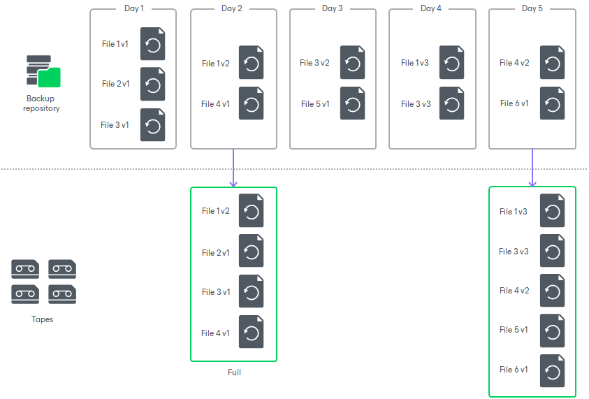

# Backup to Tape for Unstructured Data Backups

You can use backup to tape to write backups and backup copies created by file and object storage backup jobs to tapes. For more information on the file share and object storage backup, see [Unstructured Data Backup](unstructured_data_backup.md).

|  |
| --- |
| Note |
| Backup to tape for unstructured data backups is a secondary backup as it additionally secures already backed up file share and object storage data. Thus, this functionality does not consume license instances. |

Using backup to tape for unstructured data backups has the following benefits:

* It allows avoiding excessive load on the production file share storage.
* It allows implementing the '3-2-1' backup approach (3 copies, 2 types of media, 1 offsite location) considered as a best practice for data protection and disaster recovery.

Just like with ordinary backup to tape jobs, as a source you can specify either file backup jobs, object backup jobs, or repositories that store unstructured data backups and their copies. For more information on sources of backup to tape jobs, see [Backup to Tape](backup_to_tape_jobs.md).

When creating a backup to tape job for additionally securing unstructured data backups, consider the following:

* If the backup to tape job for unstructured data backups processes large quantities of files and objects, you must provide additional system resources. For more information, see [System Requirements for Backup to Tape Job for Unstructured Data Backups](tape_before_you_begin.md#requirements_nas).
* Files on tapes are stored in the native format.
* Backup to tape for unstructured data backups does not support [GFS](gfs_jobs.md).
* The backup to tape job for unstructured data backups can process files with names up to 255 characters long. Backup of files with longer names is not supported.
* The tape job always writes to tapes the latest restore point (the state of file share or object storage backup files as of the backup to tape job run).
* When starting a backup to tape job for unstructured data backups, Veeam Backup & Replication checks if the backup chain stored on tapes is consistent. If it is not consistent, Veeam Backup & Replication creates a new full backup based on the latest backup point of the source unstructured data backup.
* In contrast to other backup to tape jobs, if a unstructured data backup to tape job starts several times on the day when the full backup is scheduled, it creates several virtual full backups. For more information on virtual full backups, see [Virtual Full Backup](virtual_full_backup.md).

