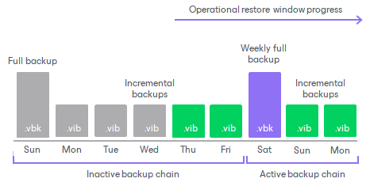

# Copying Backups to Capacity Tier

Veeam Backup & Replication allows you to copy backups from the performance extents of your scale-out backup repository to capacity extents as soon as these backups are created.

To enable data copy, make sure to select the Copy backups to object storage as soon as they are created option, as described in section [Add Capacity Tier](new_capacity_tier.md).

To copy data to capacity extents, Veeam Backup & Replication performs the following steps:

1. Veeam Backup & Replication verifies that performance extents are available and are not in the Maintenance mode.
2. After a backup (or backup copy) job that is targeted to a scale-out backup repository finishes, Veeam Backup & Replication initiates a copy session.

A complete name of each copy session consists of the backup (or backup copy) job name plus the Offload postfix. That is, if your backup (or backup copy) job name is Amazon, the copy session name will be Amazon Offload.

1. During a copy session, Veeam Backup & Replication extracts data blocks and metadata from each new backup file (.VBK, .VIB, .VRB) or data blocks created on performance extents and copies these blocks and metadata to capacity extents.

Backup files with metadata are created as described in section [Moving Backups to Capacity Tier](capacity_tier_move.md).

Having such replica gives you the ability to quickly restore data as of the latest state in case of trouble with any backup files, any unexpected failure of any of your performance extents, or even of the entire scale-out backup repository, as described in section [Restore Scenarios](capacity_tier_copy_rs.md).

Combining Copy and Move Operations

You can combine both the Copy backups to object storage as soon as they are created option and the Move backups to object storage as they age out of the operational restores window option. In such a scenario, a copy session will be copying newly created backups right upon creation.

Once the backup chain becomes inactive (for example, sealed) and exceeds the operational restore window, data blocks will be removed from each associated backup file. Such a behavior mimics [data movement](capacity_tier_move.md), but instead of moving data that was already copied, Veeam Backup & Replication purges associated data blocks from the performance extents, thereby saving traffic and reducing costs that may be incurred by your storage provider for performing read/write operations.

The following figure shows an example in which both options are enabled, suggesting that each backup file has been copied to object storage upon its creation.

The backup chain on the left becomes inactive after a new full backup file is created and consists of one .VBK file and five .VIB files. In this case, only the first four backup files (represented as grey blocks) in this inactive backup chain exceed the operational restore window. Veeam Backup & Replication will wait until .VIB files that were created on Thursday and Friday fall out of operational restore window. After that, Veeam Backup & Replication will remove blocks of data from these .VBK and .VIB files that belong to the inactive backup chain.

After copy is complete, the new Capacity Tier node appears in the Home view, under the Backups node and shows backups that have been copied to the capacity extent.

|  |
| --- |
| Note |
| The copy is not performed during prohibited hours specified in the scale-out backup repository backup window configuration. You can configure the backup window at the [Add Capacity Tier](new_capacity_tier.md) step of the New Scale-out Backup Repository wizard. |

Related Topics

* [Backup Chain Detection](capacity_tier_inactive_backup_chain.md)
* [Moving Backups to Capacity Tier](capacity_tier_move.md)
* [How Downloading from Capacity Tier Works](capacity_tier_download.md)

