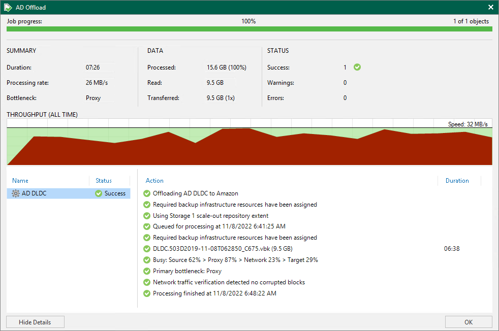

# Viewing Copy Session Results

To review copy session results, do the following:

1. Open the History view.
2. In the [inventory pane](vbr_ui.md), select the Storage management node.
3. In the working area, right-click a copy session and select Statistics.

For more information, see [Copying Backups to Capacity Tier](capacity_tier_copy.md).

Veeam Backup & Replication displays offload job session statistics for the following counters:

* The Job progress bar shows percentage of the copy session completion.
* The Summary box shows general information about the copy session:

+ Duration — duration of the copy session.
+ Processing rate — average speed of VM data processing. This counter is a ratio between the amount of data that has actually been read and the offload session duration.
+ Bottleneck — bottleneck in the data transmission process. To learn more about bottlenecks, see [Performance Bottlenecks](detecting_bottlenecks.md).

* The Data box shows information about processed data:

+ Processed — total size of all VM disks processed by the copy session.
+ Read — the amount of data read from the extents.
+ Transferred — the amount of data transferred from the performance tier to the capacity tier.

* The Status box shows information about the copy results. This box informs how many tasks have been completed with the Success, Warning and Error statuses (1 task per 1 VM).
* The pane in the lower-left corner shows a list of objects processed by the copy session.
* The pane in the lower-right corner shows a list of operations performed during the session. To see a list of operations for a specific object, click the object in the pane on the left. To see a list of operations for the whole copy session, click anywhere on the blank area in the left pane.

Related Topics

* [Viewing Offload Session Results](capacity_tier_offload_results.md)
* [Viewing Download Session Results](capacity_tier_download_results.md)

