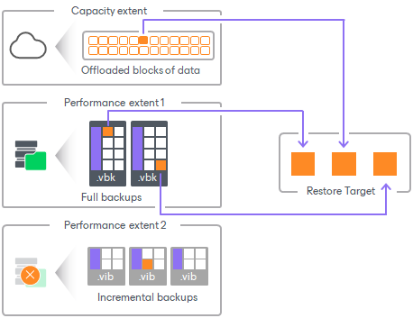
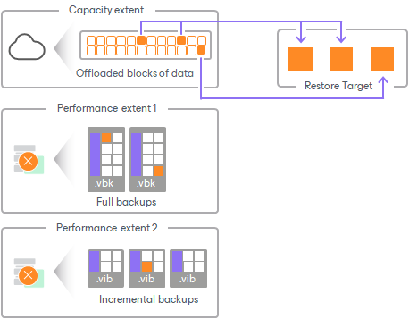

# Restore Scenarios

This section explains possible restore scenarios from the capacity tier.

Unavailability of Backup Files

If one of the offloaded backup files becomes unavailable on any of the extents in a scale-out backup repository, you can restore it by doing the following:

1. Rescan a scale-out backup repository.

For more information on how to rescan a scale-out backup repository, see [Rescanning Scale-Out Repositories](sobr_rescan.md).

1. Copy data from the capacity tier to the performance tier.

For more information on how to copy data, see [Downloading Data from Capacity Tier](downloading_from_capacity_tier.md).

|  |
| --- |
| Note |
| The performance or capacity extents must not be in the [Maintenance mode](sobr_maintenance.md). |

Unavailability of Extents

A performance extent in a scale-out backup repository may become unavailable or be in the Maintenance mode. To restore data in such case, you can use any method described in section [Data Recovery](data_recovery.md).

For example, you are restoring a virtual machine consisting of three data blocks, of which two blocks reside on the Extent 1 and another required block is stored on the Extent 2 which is unavailable. In such scenario, Veeam Backup & Replication gets two blocks from the Extent 1 and another required block from the capacity tier.

Unavailability of Scale-Out Backup Repository

To restore data if the entire scale-out backup repository is unavailable, you can use any method described in section [Data Recovery](data_recovery.md).

If the entire scale-out backup repository becomes unavailable, Veeam Backup & Replication restores data from the capacity tier only.

For example, both performance extents that store required backup files to restore a virtual machine are not available. In such a scenario, Veeam Backup & Replication restores data from the capacity tier only.

Unavailability of Backup Server

To get access to backups in the capacity tier in case the entire configuration of the backup server becomes corrupted and your scale-out backup repositories are no longer available, you can:

* Restore the configuration of the backup server from the configuration backup, as described in section [Managing Configuration Database](vbr_config.md).
* Import backups from the capacity tier, as described in section [Importing Object Storage Backups](osr_import_backups.md).

Related Topics

* [Add Capacity Tier](new_capacity_tier.md)
* [Moving Backups to Capacity Tier](capacity_tier_move.md)
* [Copying Backups to Capacity Tier](capacity_tier_copy.md)

