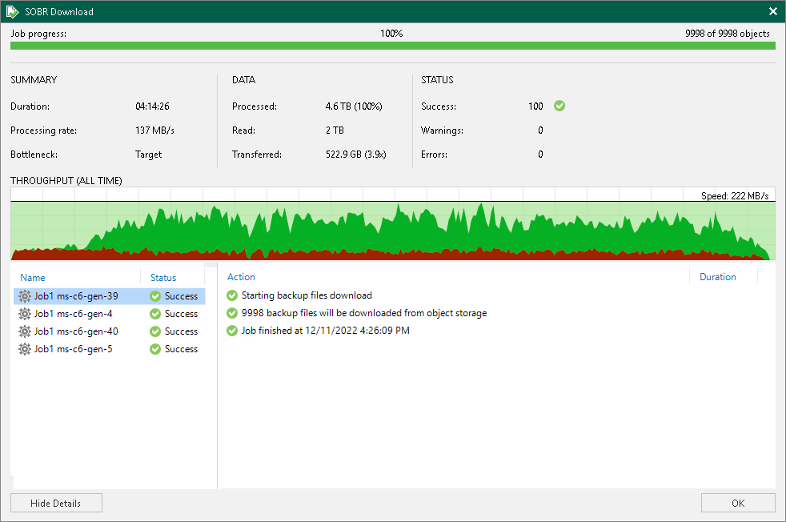

# Viewing Download Session Results

To review SOBR Download job session results, do the following:

1. Open the History view.
2. In the [inventory pane](vbr_ui.md), select the Storage management node.
3. In the working area, right-click a SOBR Download session and select Statistics.

For more information, see [How Downloading from Capacity Tier Works](capacity_tier_download.md).

Veeam Backup & Replication displays SOBR Download job session statistics for the following counters:

* The Job progress bar shows percentage of the job completion.
* The Summary box shows general information about the job session:

+ Duration — duration of the job session.
+ Processing rate — average speed of data processing. This counter is a ratio between the amount of data that has actually been read and the job session duration.
+ Bottleneck — bottleneck in the data transmission process. To learn more about bottlenecks, see [Performance Bottlenecks](detecting_bottlenecks.md).

* The Data box shows information about processed data:

+ Processed — total size of data blocks being downloaded from object storage repository plus blocks (if any) being taken from the extents of your scale-out backup repository.
+ Read — the amount of data read from both the object storage repository and extents of your scale-out backup repository.
+ Transferred — the amount of data downloaded from object storage.

* The Status box shows information about the job results. This box informs how many tasks have completed with the Success, Warning and Error statuses.
* The pane in the lower-left corner shows a list of objects processed by the job.
* The pane in the lower-right corner shows a list of operations performed during the session. To see a list of operations for a specific object, click the object in the pane on the left. To see a list of operations for the whole job session, click anywhere on the blank area in the left pane.

Related Topics

* [Viewing Offload Session Results](capacity_tier_offload_results.md)
* [Viewing Copy Session Results](capacity_tier_copy_results.md)

