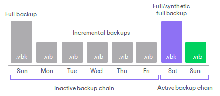
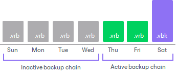
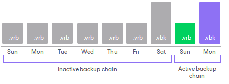

# Backup Chain Detection

Veeam Backup & Replication will transfer to capacity extents only those restore points that belong to inactive backup chains. To ensure a backup chain is inactive, Veeam Backup & Replication verifies its state. This does not apply to the [copy policy](capacity_tier_copy.md): all newly created restore points are copied immediately.

When a backup job runs for the first time, Veeam Backup & Replication creates an initial full backup file. It contains complete information about the VMs that are being backed up. With each subsequent backup job session, new incremental backup files are created. They contain only the changes that have occurred since the last backup session.

For forward incremental backup method, the active backup chain is the one that has not yet been sealed with a new full backup file.

To transform an active backup chain into inactive, a new active full (or synthetic full) backup file must be created for this chain. This can be done either manually, as described in section [Performing Active Full Backup](performing_active_full_backup.md). Else, you can configure a schedule according to which new active or synthetic full backups will be created automatically, as described in sections [Active Full Backup](active_full_backup.md) and [Synthetic Full Backup](synthetic_full_backup.md).

Once a new full backup file is created and the offload session is being executed, Veeam Backup & Replication collects all the restore points (full and incremental) that were created prior to the latest active full, verifies that they belong to an inactive chain, and prepares them to be moved to capacity extents. This process is called detect. For more information, see [Moving Backups to Capacity Tier](capacity_tier_move.md).

The same applies to backup chains created by [backup copy jobs](backup_copy.md). Veeam Backup & Replication will transfer to capacity extents only those restore points that belong to an inactive backup copy chain. Note that if you enable [backup copy GFS](backup_copy_gfs.md), Veeam Backup & Replication implements the forward incremental retention policy. If you disable backup copy GFS, Veeam Backup & Replication implements the forever forward incremental retention policy.

Note that Veeam Backup & Replication will not transfer to the capacity tier the corrupted restore points and the files dependent on those. For more information on the corrupted restore points, see [Health Check for Backup Files](backup_health_check.md).

The same applies to the backup chains created with the reverse-incremental method. In this case, all the .VRB files starting from the third restore point will be considered inactive automatically. Thus, you do not need to create an active full (nor synthetic full) backup manually unless you want to offload all the restore points including the most recent .VBK file and the first two .VRB files.

Consider the following examples:

* Four VRB files are inactive and can be offloaded:

* Six VRB files and a VBK file belong to an inactive chain and can be offloaded:

|  |
| --- |
| Note |
| A full backup file and the first two incremental backup files (that is, two .VRB files that immediately follow the most recent .VBK file) will not be offloaded until another full backup file is created successfully. |

The structure of the backup chains can be different. That depends on whether your backups were created using the per-machine method (for more information, see [Backup Chain Formats](per_vm_backup_files.md)) or as a single-file backup, with all VMs placed into a single file. The type of the backup chain structure does not affect the offload process.

For more information on how Veeam Backup & Replication creates and manages backup chains, see [Backup Chain](backup_files.md).

