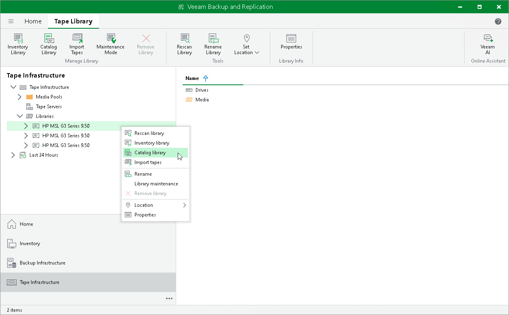
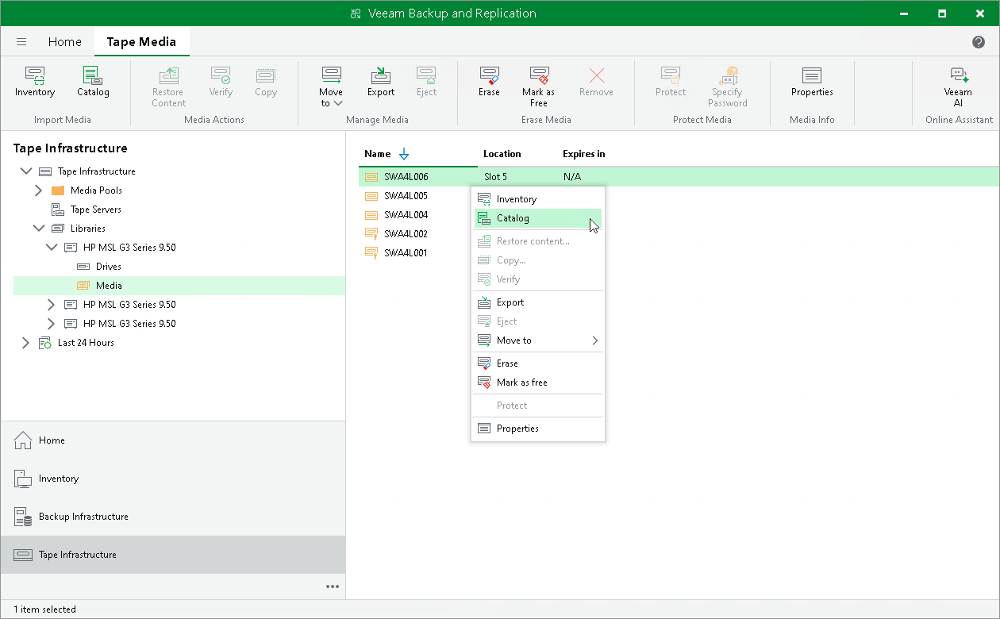

# Cataloging Tapes

In this article

Cataloging tapes is required for tapes that contain some data but are not registered in the Veeam database. For example, cataloging is required for tapes that were written on another Veeam backup server. After the cataloging procedure, you can restore data from the tapes.

When a catalog job is performed, Veeam Backup & Replication first performs tape inventory, reads the information about backup contents on tape from the tape catalog information, scans tape contents and updates the database with details of new detected backup sets.

You can perform tape catalog job for a whole [tape library](#library) or for [selected tapes](#tape).

Cataloging Tape Libraries

To catalog a whole tape library:

1. Open the Tape Infrastructure view.
2. Expand the Libraries node and select the library you want to catalog.
3. Click Catalog Library on the ribbon. Alternatively, you can right-click the tape library and select Catalog library.

Cataloging Tapes

|  |
| --- |
| Note |
| We recommend to catalog in one session all the tapes written within the same backup set. Otherwise (if cataloging not all the tapes, or cataloging them in different sessions), not all the data may be correctly imported into the database and Veeam Backup & Replication may require cataloging the same tapes again. |

To catalog selected tapes:

1. Open the Tape Infrastructure view.
2. Navigate to the list of tapes either under the Media Pools or under the Libraries > LibraryName node > Media.
3. Select the necessary tapes in the list and click Catalog on the ribbon. Alternatively, you can right-click the selected tapes and choose Catalog.

Once the catalog job finishes, Veeam Backup & Replication ejects the tape to a library slot to prevent the tape from being accidentally overwritten. However, this does not apply to standalone tape drives.

The catalog log will display job session results. To access the catalog session details, you can open the History view and locate the necessary session under the Jobs > Tape node.

Cataloging Tips

Rescanning of tapes during the catalog job may take a lot of time. To speed up the cataloging process, you can do one of the following:

* First, run inventory job to identify tape media sets and decide which tapes you want to catalog. Run the catalog job only against tapes in the necessary media set.
* If you work with a tape library, you can run the catalog job against the whole media set at once.
* If you work with a standalone drive, start cataloging from the last tape in the media set (as this tape usually stores on tape catalog information).

System Requirements for Large Number of Files on Tape

If the tape backup contains a large quantity of files, for example, more than 1 000 000 files in 1 000 folders, you must provide the following system resources:

* Backup server: 1.3 GB RAM per each 1 000 000 files
* Tape server: 800 MB RAM per each 1 000 000 files

Page updated 11/16/2023

Page content applies to build 13.0.1.1071
