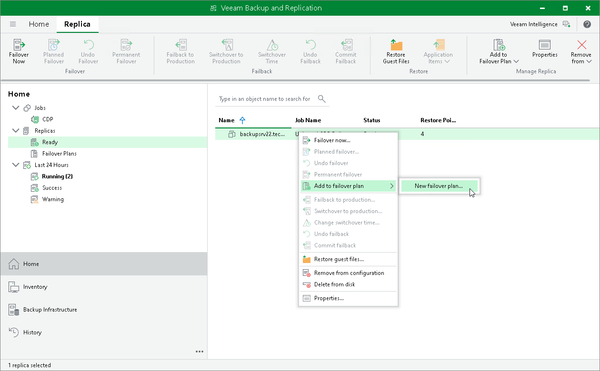

# Step 1. Launch New Failover Plan Wizard

In this article

To launch the New Failover Plan wizard, do one of the following:

* Open the Home view. In the working area, select VMs that you want to add to a failover plan. On the ribbon, click Add to Failover Plan > New failover plan if you want to create a new failover plan, or Add to Failover Plan > <Plan Name> if you want to add VMs to an existing failover plan.
* Open the Home view. In the working area, select VMs that you want to add to a failover plan and right-click one of them. Select Add to failover plan > New failover plan if you want to create a new failover plan, or Add to failover plan > <Plan Name> if you want to add VMs to an existing failover plan.

Page updated 9/25/2025

Page content applies to build 13.0.1.1071
