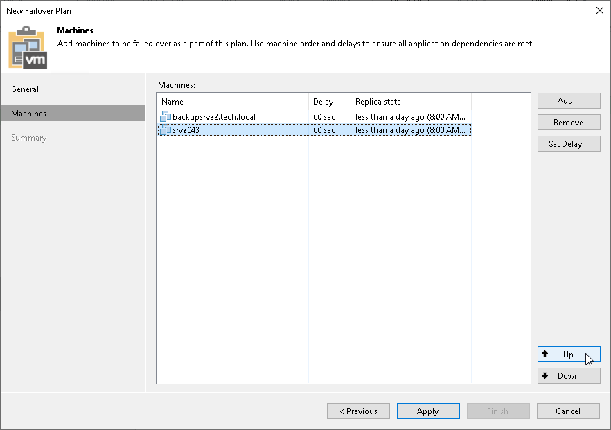

# Step 4. Define VM Failover Order

At the Virtual Machines step of the wizard, click Up and Down to change the processing order. VMs at the top of the list have a higher priority and will be started first. If some VMs provide environment for other dependent VMs, make sure that they are started first.

