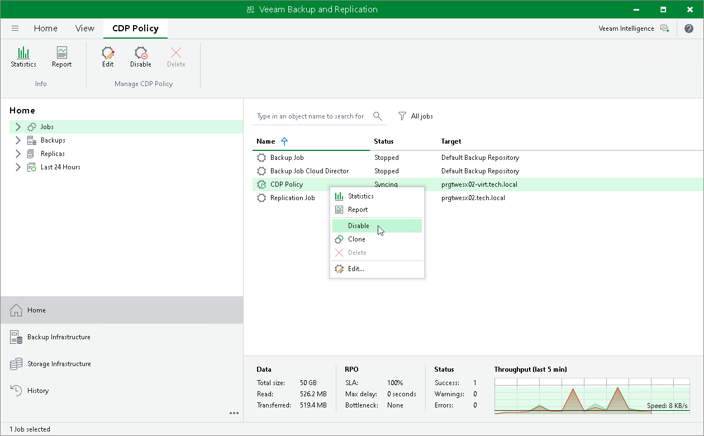
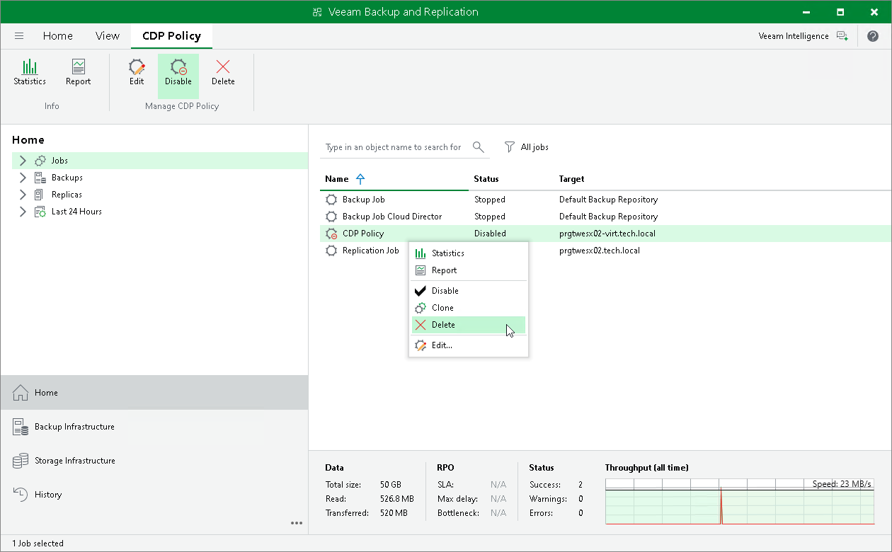

# Disabling and Deleting Policies

In this article

Veeam Backup & Replication allows you to temporarily disable or permanently delete created CDP policies.

Disabling CDP Policies

To disable a CDP policy:

1. Open the Home view.
2. In the inventory pane, navigate to the Jobs > CDP node.
3. In the working area, select the necessary policy and select Disable on the ribbon. Alternatively, right-click the necessary policy and select Disable.

|  |
| --- |
| Tip |
| To enable a disabled policy, select it and click Disable once again. |

Deleting CDP Policies

Veeam Backup & Replication allows you to delete only disabled policies. To delete a CDP policy:

1. Open the Home view.
2. In the inventory pane, navigate to the Jobs > CDP node.
3. Check that you have disabled the policy that you want to delete.
4. In the working area, select the necessary policy and select Delete on the ribbon. Alternatively, right-click the necessary policy and select Delete.

Page updated 1/25/2024

Page content applies to build 13.0.1.1071
