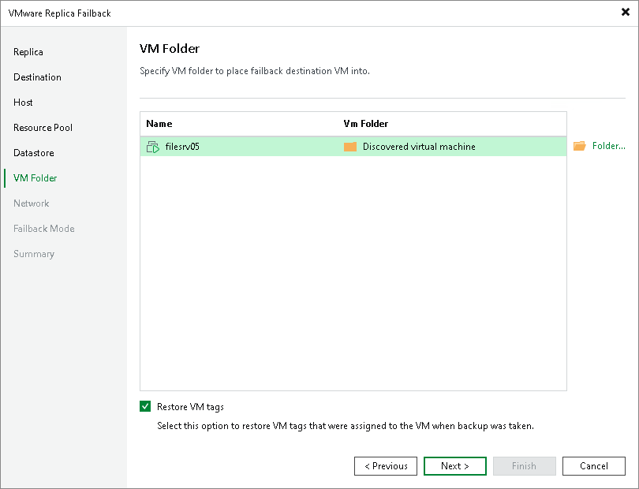

# Step 7. Select Folders

The VM Folder step is available if you have selected the Failback to the specified location option at the [Destination](cdp_failback_destination.md) step.

At the VM Folder step of the wizard, specify folders in the target datastores where all files of the recovered VMs will be stored.

If you want the recovered VMs to have the same tags as the source VMs, select the Restore VM Tags check box.

|  |
| --- |
| Note |
| Consider the following:   * You can select destination folders only if you recover VMs to destinations other than standalone hosts. * You can recover VM tags only if you recover VMs to their original locations, and the source VM tags are still available on the source vCenter Server. |

