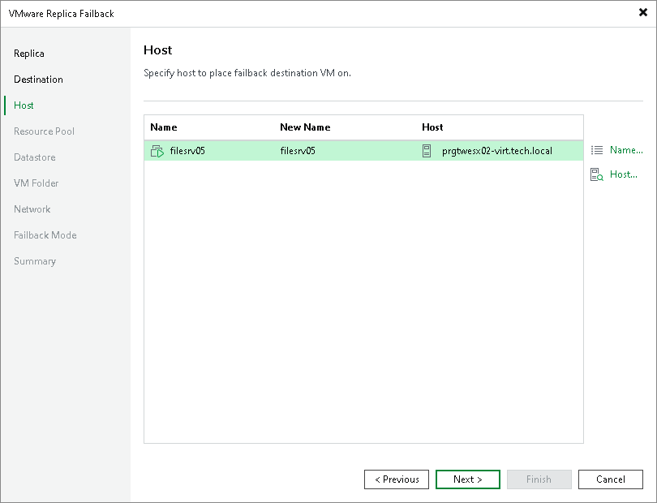

# Step 4. Select Hosts or Clusters

The Host step is available if you have selected the Failback to the specified location option at the [Destination](cdp_failback_destination.md) step.

At the Host step of the wizard, specify names for the recovered VMs and destination where the recovered VMs will be registered. You can select hosts or clusters as the destination. To specify these options, select one or multiple VMs and use Host or Name button.

