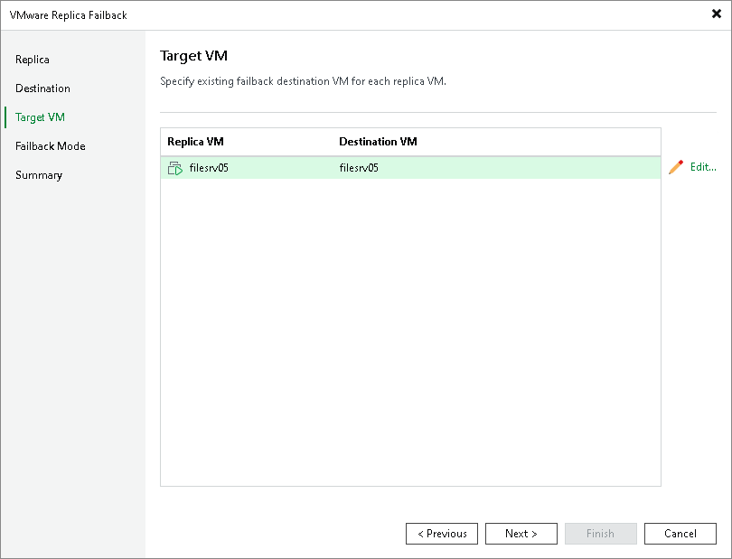

# Step 9. Map Replicas to Restored VMs

In this article

The Target VM step is available if you have selected the Failback to the original VM restored in a different location option at the [Destination](cdp_failback_destination.md) step.

At the Target VM step of the wizard, specify to which VMs you want to fail back from replicas. These VMs must be already restored from backups in the required location.

Page updated 8/21/2025

Page content applies to build 13.0.1.1071
