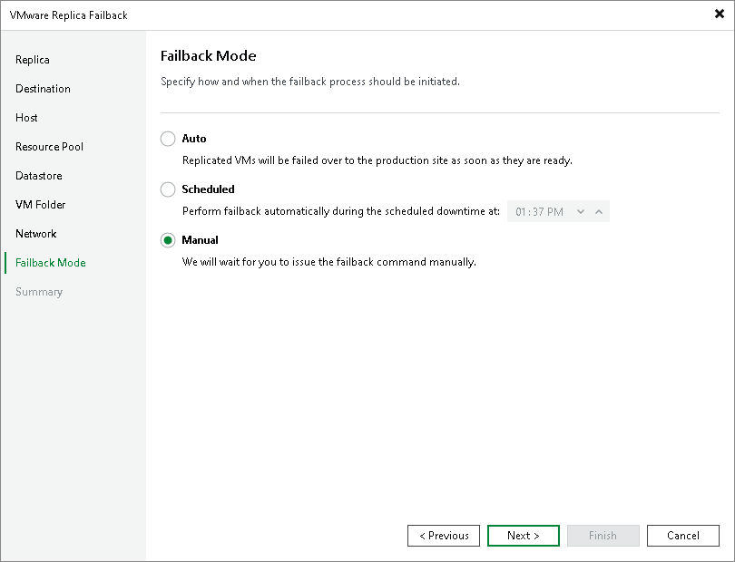

# Step 10. Schedule Switch to Production VMs

In this article

At the Failback Mode step of the wizard, specify when switch from replicas to production VMs must be performed:

* Select Auto if you want Veeam Backup & Replication to perform the switch automatically right after the state of the production VMs is synchronized with the state of their replicas.
* Select Scheduled if you want Veeam Backup & Replication to perform the switch at a specific time.
* Select Manual if you want to perform the switch manually.

If you select the Scheduled or Manual option, you can further reset/set the scheduled time or switch to the production VM manually. For more information, see [Changing Switching Time](cdp_failback_change_switching_time.md) and [Switching to Production VMs Manually](cdp_failback_switch_manually.md).

Page updated 1/28/2025

Page content applies to build 13.0.1.1071
