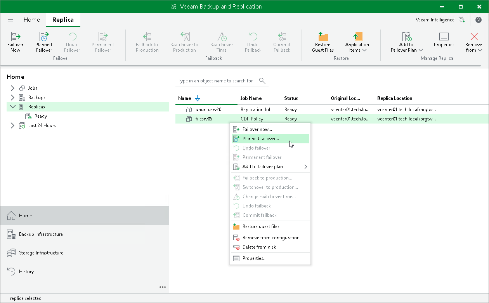

# Step 1. Launch VMware Planned Failover Wizard

To launch the VMware Planned Failover wizard, do one of the following:

* On the Home tab, click Restore and select <Platform> > Restore from replica > Entire replica > Planned failover to a replica.
* Open the Home view, expand the Replicas node. In the working area, select one or more VMs and click Planned Failover on the ribbon. You can also right-click one of the selected VMs and click Planned Failover.
* Open the Inventory view. In the working area, select one or more VMs and right-click one of the selected VMs and click Restore > Planned Failover.

