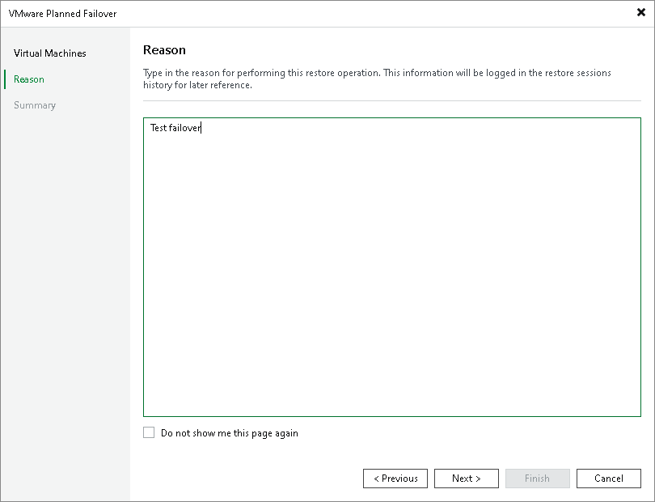

# Step 3. Specify Failover Reason

In this article

At the Reason step of the wizard, enter a reason for failing over to the replicas. The information you provide will be saved in the session history and you can reference it later.

Page updated 11/22/2023

Page content applies to build 13.0.1.1071
