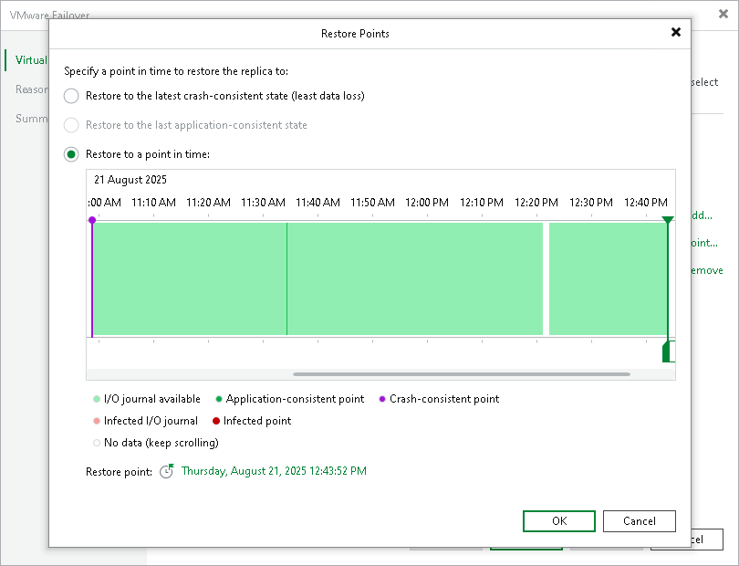

# Step 3. Select Restore Points

At the Virtual Machines step of the wizard select to which state of replicas you want to fail over:

1. In the Virtual machines to failover list, select the necessary VM and click Point.
2. In the Restore Points window, select whether you want to fail over to the latest available crash-consistent restore point, to the latest long-term application-consistent restore point or to a specific point in time.

To restore to a short-term restore point, select a point in the green area. The darker the green, the more I/O load was produced on the source VM. To restore to a crash-consistent or application consistent long-term point, select a violet or turquoise vertical bar with a circle at the top.

If you fail over to a specific point in time, use the right and left arrows on the keyboard to select the required restore point. To quickly find a long-term restore point, click a link that shows a date. In the opened window, you will see a calendar where you can select the necessary day. In the Timestamp section, you will see long-term restore points created during the selected day.

