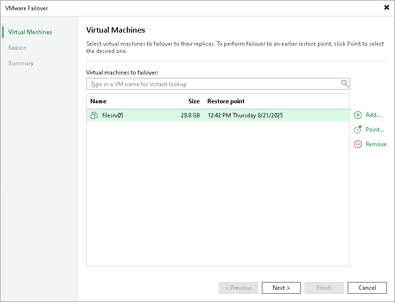

# Step 2. Select VMs

In this article

At the Virtual Machines step of the wizard, you can modify a list of VMs from which you fail over. To add VMs or VM containers, click Add > From infrastructure if you want to add VMs from the virtual infrastructure, or Add > From replicas if you want to add VMs from existing replicas. Then select the necessary VMs or VM containers. If you select VM containers, Veeam Backup & Replication will expand them to a plain VM list.

Page updated 8/18/2023

Page content applies to build 13.0.1.1071
