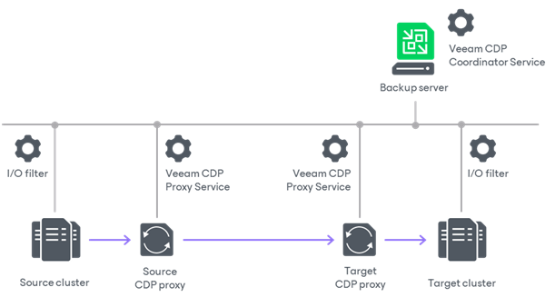

# Backup Infrastructure for CDP

The following backup infrastructure components are required for CDP:

* [Backup server](#backup_server)
* [Source and target hosts](#hosts)
* [CDP proxies](#cdp_proxies)

Backup Server

The backup server is the configuration, administration and management core of the backup infrastructure. The backup server runs the Veeam CDP Coordinator Service. This service coordinates replication and data transfer tasks, and controls resource allocation. We recommend you to place the backup server in the target site or as a separate unit.

For more information on the backup server, see [Backup Server](backup_server.md).

Source and Target Hosts

The source and the target hosts are two terminal points between which replicated VM data is moved. The source and target hosts must be a part of the same cluster or two different clusters. In turn, clusters must be managed by the same vCenter Server or two different vCenter Servers connected to the same backup server. For more information on requirements to the hosts and how to add vCenter Servers to the backup infrastructure, see the [Requirements and Limitations](cdp_requirements.md) and [Adding VMware vSphere Servers](add_vmware_server.md) sections.

The source and target hosts perform the following tasks:

* The source host reads VM disk data, reads and processes I/O operations and sends data to source proxies. The data is sent uncompressed.
* The target host receives data from target proxies and saves this data to replicas on the datastore. Also, the target host manages replicas: creates replicas, retains restore points and so on.

I/O Filter on Hosts

To be able to use hosts for CDP, you must install the I/O filter on each cluster where hosts reside. After you launch the I/O filter installation, Veeam Backup & Replication requests the vCenter Server to install and configure the I/O filter on existing clusters and hosts. For more information on how to install the filter, see [Installing I/O Filter](cdp_io_filter_install.md).

It is the I/O filter that reads and processes I/O operations in transit between the protected VMs and their underlying datastore and that sends/receives data to/from CDP proxies. Also, the filter communicates with the Veeam CDP Coordinator Service on the backup server and notifies the service that the backup infrastructure must be reconfigured if any proxy becomes unavailable. This I/O filter is built on the basis of vSphere API for I/O filtering (VAIO).

CDP Proxies

A CDP proxy is a component that operates as a data mover and transfers data between the source and target hosts. We recommend you to configure at least two CDP proxies: one (source proxy) in the production site and one (target proxy) in the disaster recovery site.

The source and target CDP proxies perform the following tasks:

* The source proxy prepares data for short-term restore points from data received from the source host, compresses and encrypts the data (if encryption is enabled in the [network traffic rules](internet_rule.md)). Then sends it to the target proxy.
* The target proxy receives the data, decompresses and decrypts it, and then sends to the target host.

For more information on CDP proxies, their requirements, limitations and deployment, see [CDP Proxies](cdp_proxy.md).

