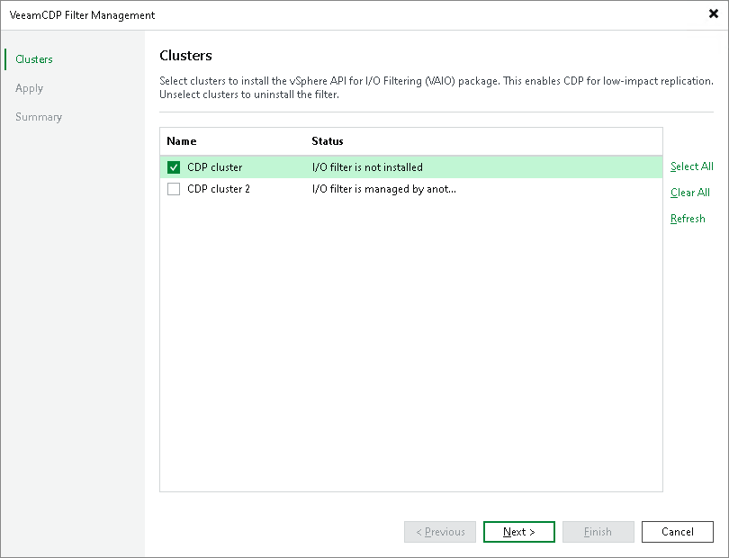

# Step 2. Select Clusters

At the Clusters step of the wizard, select check boxes near clusters on which you want to install the I/O filter.

If you select check boxes near clusters where the filters are already installed, Veeam Backup & Replication will update the filters. If you clear check boxes, Veeam Backup & Replication will delete the I/O filter from these clusters.

|  |
| --- |
| Note |
| Consider the following:   * If another user has already installed the I/O filter on a cluster, you will be prompted whether to take ownership. For more information, see [Taking I/O Filter Ownership](cdp_io_filter_ownership.md). * If you add a new cluster to the vCenter server after the I/O filter is installed on the existing clusters, you need to install the I/O filter manually on the newly added cluster. To do that, open the I/O Filter Management wizard, make sure that check boxes are selected near all clusters where the I/O filter must be present and finish the wizard. |

