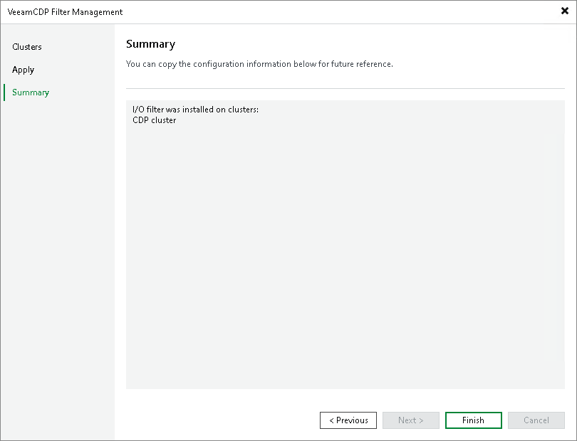

# Step 4. Finish Working with Wizard

In this article

At the Summary step of the wizard, review on which clusters the I/O filter is installed and click Finish to exit the wizard.

Page updated 10/17/2025

Page content applies to build 13.0.1.1071
