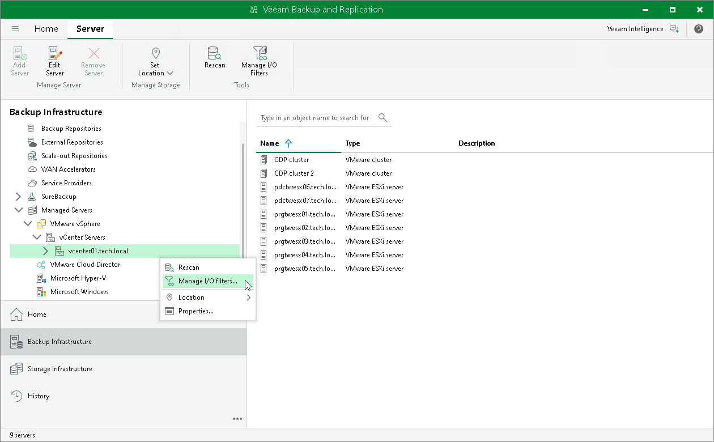

# Step 1. Launch I/O Filter Management Wizard

In this article

To launch the VeeamCDP Filter Management wizard, do one of the following:

* Open the Backup Infrastructure view. In the inventory pane, navigate to the Managed Servers > VMware vSphere > vCenter Servers > <vCenter Server Name> node. Right-click the node and select Manage I/O filters. Alternatively, click Manage I/O Filters on the ribbon.
* Open the Inventory view. In the inventory pane, navigate to the Virtual Infrastructure > VMware vSphere > vCenter Servers > <vCenter Server Name> node. Right-click the node and select Manage I/O filters. Alternatively, click Manage I/O Filters on the ribbon.

Alternatively, you can install the I/O filter on an individual cluster. To do this, use one of the paths described in the list, open the <vCenter Server Name> node and right-click the <Cluster Name> node. Select Install I/O filter.

Page updated 10/17/2025

Page content applies to build 13.0.1.1071
