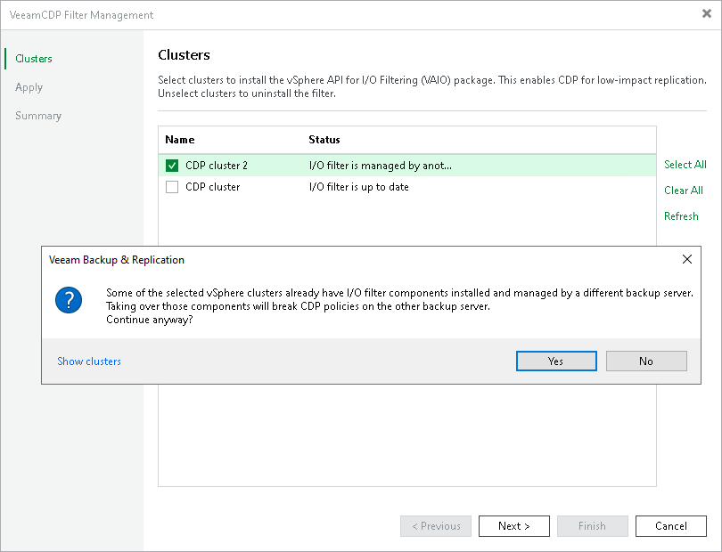

# Taking I/O Filter Ownership

After the backup server finishes installation of the I/O filter on a cluster, the backup server becomes the owner of the I/O filter and its components.

The I/O filter can belong only to one backup server at a time. If a client B re-installs the I/O filter that was previously installed by a client A, the client A loses the ownership privileges over the filter. Losing privileges means that the client A will no longer be able to manage CDP policies and replicas. All policies created by the client A will fail.

If the I/O filter is managed by another client, you will see a warning when trying to install the filter. If you are sure that the client who installed the I/O filter first does not need it anymore, you can take the ownership. To do that, click Yes in the Veeam Backup & Replication window and finish the I/O Filter Management wizard as described in section [Installing I/O Filter](cdp_io_filter_install.md).

