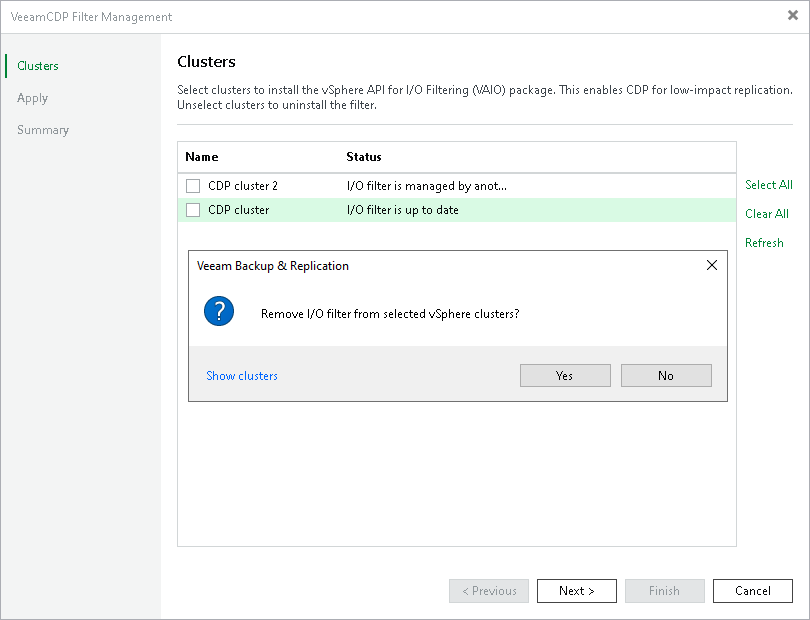

# Updating and Uninstalling I/O Filter

Veeam Backup & Replication allows you to update or uninstall the I/O filter from organization VDCs using the Veeam Backup & Replication console.

Requirements

Consider the following:

* Make sure that you have disabled or deleted all CDP policies as described in section [Disabling and Deleting Policies](cdp_disable.md).
* [When uninstalling the filter] If you have manually assigned the Veeam CDP Replication storage policy to VMs that are parts of the clusters, you must change the storage policy for these VMs. For more information on how to change storage policies, see [VMware Docs](https://docs.vmware.com/en/VMware-vSphere/7.0/com.vmware.vsphere.storage.doc/GUID-D6A099C5-8F80-474C-A79A-64F5EC4455DA.html).

If replicas are still present in the Veeam Backup & Replication configuration database, you can [remove them from the configuration](cdp_remove_from_config.md). To see the list of replicas, open the Home view. In the inventory pane, click the Replicas node.

* When you upgrade Veeam Backup & Replication to the current version, you can postpone the upgrade of the I/O filter on the vCenter Servers to a later time. Veeam Backup & Replication supports the postponed upgrade for the minor versions within the 12 version. You must postpone the upgrade or upgrade all clusters on the vCenter Servers. Partially upgraded vCenter Servers or clusters have limited functionality. You cannot add VMs from such vCenter Servers or clusters to CDP policies, commit failback and perform some other operations.
* If VMware vSphere Distributed Resource Schedule (DRS) is disabled for the clusters, place the hosts of the clusters in the Maintenance mode.

You can simultaneously place all hosts in the Maintenance mode or place them one by one for each cluster. Veeam Backup & Replication will uninstall/update the filter only on the hosts in the Maintenance mode. That is why you must repeat the procedure (place a host in the Maintenance mode and launch installation/update) for each host in a cluster. When Veeam Backup & Replication uninstalls/updates the filter on the last host in the cluster, it also uninstalls/updates the filter on the cluster.

If DRS is enabled and the hosts use the shared storage, you do not have to put hosts in the Maintenance mode manually. VMware vSphere will automatically place hosts in the Maintenance mode according to your settings and migrate VMs from one host to another.

* The update of the I/O filter commonly does not require a reboot.

Updating or Uninstalling I/O Filter

To update or uninstall the I/O filter, do the following:

1. Launch the VeeamCDP Filter Management wizard as described in section [Launch I/O Filter Management Wizard](cdp_io_filter_launch.md).
2. At the Clusters step of the wizard, do the following:

* To update the filter, make sure that check boxes are selected near the necessary clusters.
* To uninstall the filter, clear the check boxes near the necessary clusters.

1. Proceed to the last step of the wizard and close the wizard.

As an alternative, you can uninstall the I/O filter from a specific cluster. To do this, open the Inventory view. In the inventory pane, navigate to the Virtual Infrastructure > VMware vSphere > vCenter Servers > <vCenter Server Name> > <Cluster Name> node and right-click it. Select Uninstall I/O filter.

|  |
| --- |
| Note |
| If the upgrade attempt has failed, fix the problems listed in the wizard and launch the upgrade again. During the next upgrade operation, you may see the following error: "The specified key, name or identifier 'vibUrl' already exists. The VIB contains the same filter as the one to be upgraded". If this is the only error, it can be ignored. The error is shown because during the previous upgrade filters were already upgraded on some components. The remaining components are upgraded on the current run. To make sure that upgrade completed successfully, launch the upgrade wizard once again. |

